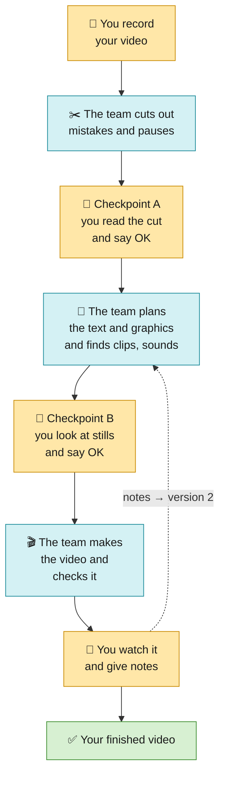
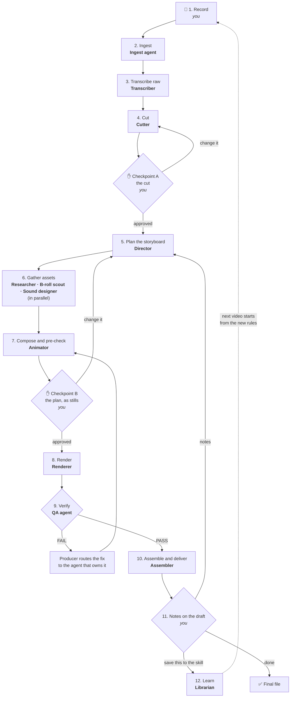
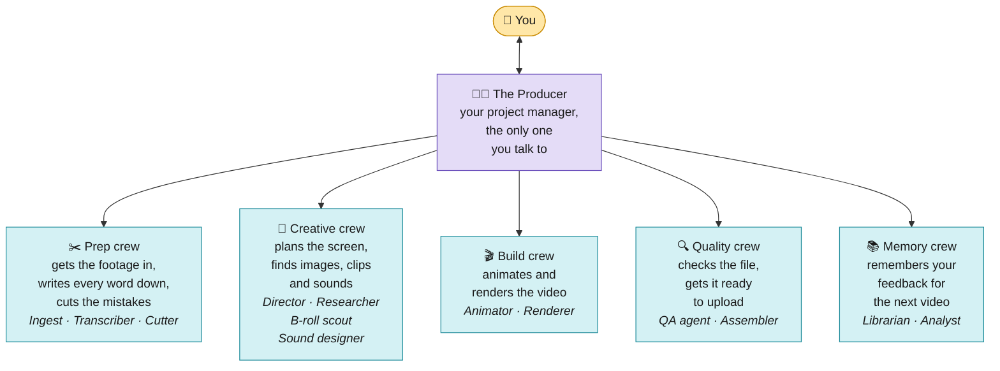
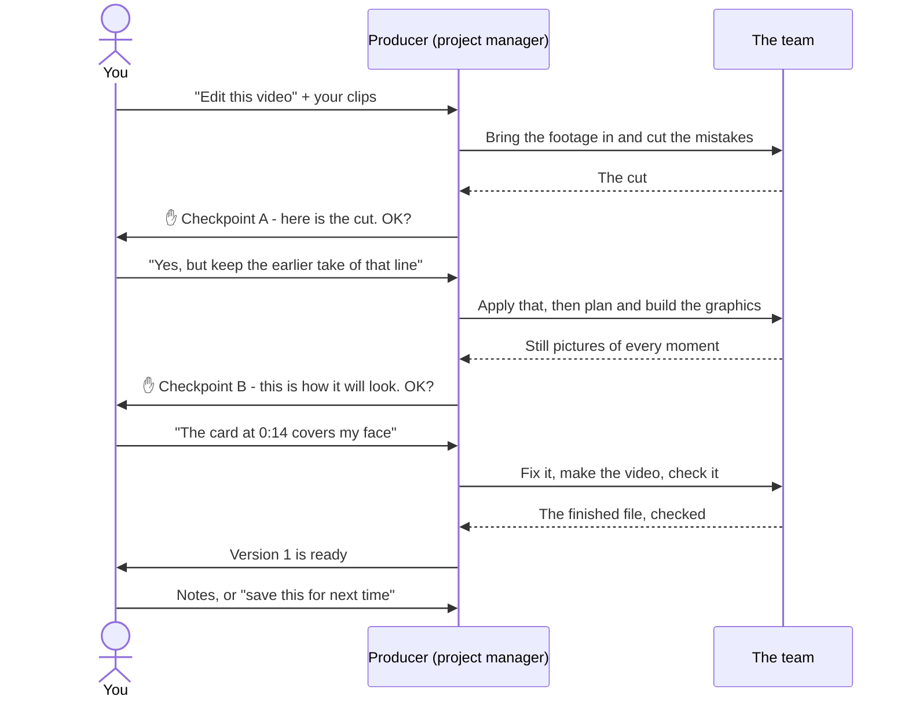
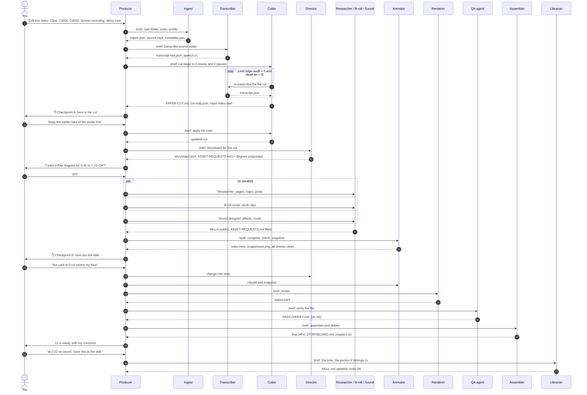
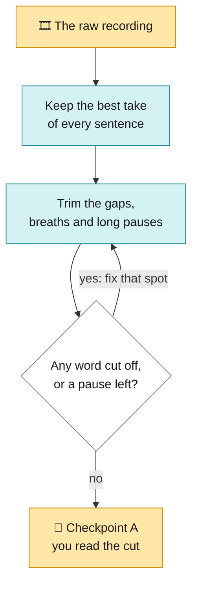
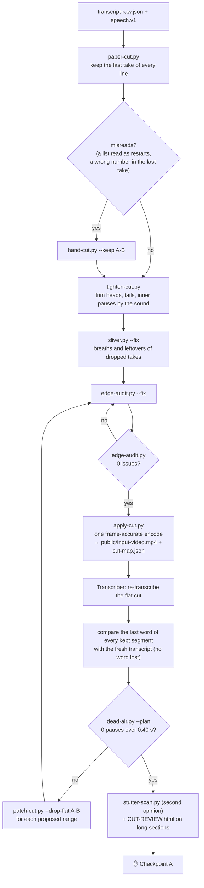
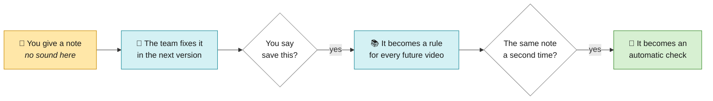

# Editing workflow

How a video goes from the camera to a finished, checked file, who does each part, and how the parts hand work to each
other.

This system is built on a kit, kept in [`kit/`](kit/README.md): a YouTube creator's Claude Code editing skill, kept as
it came apart from two fixes (the font folder and `storyboard-md.py`). The kit supplies the rules (`youtube-edit/SKILL.md`), the scripts (`youtube-edit/scripts/`), the look
(`STYLE-GUIDE.md`) and the prompts (`PROMPTS.md`). This folder adds the layer on top: a team of agents with clear
jobs, a fixed order, file hand-offs, quality gates and a learning loop.

| Folder | What it is | Status |
|---|---|---|
| this README | the workflow, the team, the stages, the gates | ✅ |
| [`kit/`](kit/README.md) | the kit everything builds on: the `youtube-edit` skill (rules, scripts and their tests, fonts), the style guide, the setup guide and the prompts | ✅ |
| [`templates/`](templates/README.md) | the four project files: `STATUS.md`, `ASSET-REQUESTS.md`, `QA.md`, `NOTES.md` | ✅ |
| [`longform/`](longform/README.md) | the agent team for **YouTube long-form** (8 to 25 min, 4K 30 fps, free tools only): the Producer skill, the long-form playbook, 13 agent files, and the research behind them | ✅ |
| [`reels/`](reels/README.md) | the agent team for **Reels** (9:16, 1080x1920, 60 fps, free tools only): the Producer skill, the Reels playbook, 11 agent files, tested vertical scripts, and the research behind them | ✅ |

> **Free tools only.** Every profile uses free tools and free licences, nothing else. The kit's paid routes (Tella,
> Epidemic Sound, AI B-roll) are never used, nor paid stock or music, AI video generators (Motion by Mosaic, Runway and
> the like) or paid trials. The one paid part is the Claude plan that runs Claude Code. See section 12.

> **Marking used in this document**
> - `kit`: comes from the kit in [`kit/`](kit/README.md), works today.
> - `new`: added by this workflow (a file, a step or a rule the kit does not have).
> - `to build`: planned and not written yet.

---

## Contents

1. [The workflow at a glance](#1-the-workflow-at-a-glance)
2. [The team: a Producer and twelve agents](#2-the-team-a-producer-and-twelve-agents)
3. [How the agents work together](#3-how-the-agents-work-together)
4. [The project folder: every file, who writes it, who reads it](#4-the-project-folder-every-file-who-writes-it-who-reads-it)
5. [Stage by stage](#5-stage-by-stage)
6. [The agents in detail](#6-the-agents-in-detail)
7. [Quality gates](#7-quality-gates)
8. [When something fails](#8-when-something-fails)
9. [The learning loop](#9-the-learning-loop)
10. [Output profiles: YouTube and Reels](#10-output-profiles-youtube-and-reels)
11. [What you type](#11-what-you-type)
12. [Setup](#12-setup)
13. [Glossary](#13-glossary)

---

## 1. The workflow at a glance

You do four things: **record**, answer **Checkpoint A** (the cut), answer **Checkpoint B** (the plan) and give **notes**
on the draft. Everything else is the agents' job.



<sub>🟨 yellow = you · 🟦 blue = the AI team · 🟩 green = finished</sub>

At each 👀 checkpoint you can ask for changes in plain words; the team redoes that part before going on. Nothing is
made until you have said OK to the stills.

<details>
<summary>Show the detailed version (every stage and the agent that runs it)</summary>



</details>

The **Producer** (the main Claude Code conversation) sits above all of this. It starts each agent, keeps the project's
status, and is the only one that talks to you.

### The same thing as a timeline

| # | Stage | Agent | You | Output you can look at |
|---|---|---|---|---|
| 1 | Record | none | record the clips | raw files |
| 2 | Ingest | Ingest agent | drop the files in, say what they are | `ingest.json`, `metadata.json` |
| 3 | Transcribe | Transcriber | none | `transcript-raw.json` |
| 4 | Cut | Cutter | none | `PAPER-CUT.md`, `CUT-REVIEW.html` |
| A | **Checkpoint A** | Producer | read the cut, reply in plain words | none |
| 5 | Plan | Director | confirm any diagram it proposes | `storyboard.json`, `ASSET-REQUESTS.md` |
| 6 | Assets | Researcher, B-roll scout, Sound designer | none | `ASSET-REQUESTS.md` filled in (every file + source + licence) |
| 7 | Compose | Animator | none | `public/index.html`, `snaps/sheet.png` |
| B | **Checkpoint B** | Producer | look at the stills, reply in plain words | none |
| 8 | Render | Renderer | none | `output-*.mp4` |
| 9 | Verify | QA agent | none | `VERIFY.md`, `render-sheet.png`, `QA.md` |
| 10 | Assemble + deliver | Assembler | none | the final MP4, `STORYBOARD.md`, `chapters.txt` |
| 11 | Notes | Producer | watch it, give timestamped notes | v2, v3... |
| 12 | Learn | Librarian | say "save this to the skill" | an updated `SKILL.md` |

---

## 2. The team: a Producer and twelve agents



<sub>🟨 yellow = you · 🟦 blue = the AI team · 🟩 green = finished</sub>

The twelve agents and what each one does are in the table below.

| # | Agent | One-line job | Kit scripts it runs | Model tier |
|---|---|---|---|---|
| 0 | **Producer** | Runs the project: starts agents, holds the status, runs the checkpoints, routes fixes, talks to you | none (it delegates) | strongest |
| 1 | **Ingest agent** | Collects, probes, orders and joins the raw files; lines up face and screen recordings | `ingest.py`, `sync-tracks.py` | small |
| 2 | **Transcriber** | Turns audio into words with exact times, every time the cut changes | `npx hyperframes transcribe`, `auto-editor` | small |
| 3 | **Cutter** | Removes retakes, restarts, stutters and dead air until the flat cut is clean | `paper-cut.py`, `hand-cut.py`, `tighten-cut.py`, `sliver.py`, `edge-audit.py`, `apply-cut.py`, `dead-air.py`, `patch-cut.py`, `stutter-scan.py`, `cutlist-to-edl.py` | mid |
| 4 | **Director** | Decides what the viewer sees and when: formats, timing, camera, sound cues, B-roll slots | `phrase-times.py` | strongest |
| 5 | **Researcher** | Gets the real pages, logos, posts and screenshots the Director asked for | `npx hyperframes capture`, Chrome | mid |
| 6 | **B-roll scout** | Finds, checks the licence of, downloads and conforms stock footage | `broll-conform.py` | small |
| 7 | **Sound designer** | Picks, trims and levels sound effects and music | ffmpeg | small |
| 8 | **Animator** | Builds the composition from the storyboard and proves it before any render | `compose.py`, `formats/claude_chat.py`, `npx hyperframes check`, `beat-check.py`, `gap-scan.py`, `snap-beats.py` | mid (strongest for a new format) |
| 9 | **Renderer** | Renders the video and fixes its colour tags; patches a window of a long render | `npx hyperframes render`, `window-patch.py` | small |
| 10 | **QA agent** | Checks the rendered file independently; passes or fails it | `verify-render.py`, ffmpeg | mid |
| 11 | **Assembler** | Joins the parts, levels loudness, adds music, writes the delivery documents | `assemble.py`, `storyboard-md.py` | small |
| 12 | **Librarian** | Turns your notes into rules in the skill, and repeated notes into tested checks | `python3 -m unittest tests` | strongest |
| 13 | **Analyst** (optional) | Every two videos, measures a channel you admire against your own edits | `teardown.py` | mid |

"Model tier" follows the kit's own advice: routine passes run fine on a mid-size model, searches on a smaller one, and
a new format or an unfamiliar problem deserves the strongest.

---

## 3. How the agents work together

### 3.1 The mechanics

- **Every agent is a Claude Code subagent** `new`: a markdown file in the project's `.claude/agents/` folder with a
  name, a description, the tools it may use and a model tier. The Producer starts them with the Agent tool.
- **Agents start cold.** A subagent does not see the conversation. The Producer hands each one a **brief**: the
  project folder, the input files, the task, the SKILL.md sections to follow and the "done when" test (see 3.3).
- **Files are the hand-off.** All agents share one disk. An agent reads its inputs from the project folder, writes its
  outputs there, and returns a short report to the Producer: what it made, what it checked, what worries it.
- **Only the Producer talks to you.** Subagents cannot ask you questions and cannot start other subagents. When an
  agent needs a decision, it stops and says so in its report; the Producer asks you.
- **Only the Producer writes `STATUS.md`** `new`, the one-page state of the project (which stage, which version,
  what is waiting on whom). That way two agents never fight over it.
- **Makers never grade their own work.** The QA agent checks what the Renderer made; the Animator's pre-checks are
  scripts, not opinions. A FAIL goes back through the Producer to the agent that owns the fix.
- **You can still run it all in one conversation.** The agents are roles. Splitting them keeps each context small and
  lets independent jobs run at once; it does not change the steps or the rules.

### 3.2 One video, end to end



<details>
<summary>Show the detailed version (every hand-off and file)</summary>



</details>

### 3.3 The brief: what the Producer sends every agent `new`

Every brief has the same six parts, so no agent has to guess:

```
PROJECT   videos/<project>/            (and the profile: youtube or reels)
INPUTS    the exact files to read
TASK      what to produce, in one or two sentences
RULES     the SKILL.md sections to follow (by heading) + STYLE-GUIDE.md
DONE WHEN the test that proves it is finished (a script's clean output, a file that exists)
REPORT    files written, checks run and their result, concerns, decisions needed from the creator
```

### 3.4 What runs in parallel, and what must wait

| Can run at the same time | Why it is safe |
|---|---|
| Researcher, B-roll scout, Sound designer | each fills its own part of `ASSET-REQUESTS.md` and writes to its own folder |
| B-roll scout's *search* and the Cutter's dead-air loop | the search only needs the storyboard's slot list, not final times |
| Rendering section 2 while you review section 1 | sections are separate compositions, joined at assembly |

| Must wait | For |
|---|---|
| Director | Checkpoint A (planning on a cut that changes wastes the plan) |
| Animator | every asset request filled or marked "skip" |
| Renderer | Checkpoint B and every pre-check clean |
| Assembler | a QA **PASS** on every part |
| Librarian | your "save this to the skill" |

### 3.5 Project state `new`

Four files `new` hold everything the kit's scripts don't: where the video is, what assets it uses, whether a file
may go out, and what you asked for. Their templates, every field, every allowed value and filled-in examples are in
[`templates/`](templates/README.md).

| File | Answers | Written by |
|---|---|---|
| [`STATUS.md`](templates/STATUS.md) | Where is this video, and who is it waiting on? | Producer only |
| [`ASSET-REQUESTS.md`](templates/ASSET-REQUESTS.md) | What does the plan need, who gets it, where did it come from, may we use it? | Director (request), owner agent (fulfilment) |
| [`QA.md`](templates/QA.md) | Can this file go out? | QA agent only |
| [`NOTES.md`](templates/NOTES.md) | What did you ask for, and what was done about it? | Producer only |

A short excerpt of `STATUS.md` ([full example](templates/examples/STATUS.md)):

```
| # | Stage | State | Owner | Gate | Updated | Note |
|---|---|---|---|---|---|---|
| 4 | Cut | done | Cutter | G2 G3 G4 | 2026-10-05 10:30 | 2:11 → 38.2 s; 0 edge issues; 0 pauses |
| A | Checkpoint A: the cut | done | you | A | 2026-10-05 11:02 | A01, A02 applied |
| 9 | Verify | done | QA agent | G10 G11 | 2026-10-06 16:38 | v2 attempt 1 PASS |
| 10 | Assemble and deliver | in-progress | Assembler | G12 | 2026-10-06 16:42 | - |
```

Any new conversation can pick the project up from `STATUS.md`.

---

## 4. The project folder: every file, who writes it, who reads it

One folder per video under `videos/`, plus one shared folder for things every video reuses.

```
videos/
├── _shared/                       sounds and images every video can use (copied by compose.py --shared)
│   ├── sfx/                       pop.mp3, typing.mp3, click.mp3 ...
│   └── img/                       logos, thumbs/
└── <project>/
    ├── STATUS.md                  new   the project's state (Producer)
    ├── raw/                       your original files, never changed
    ├── ingest.json, source.mp4    Ingest
    ├── metadata.json              Ingest
    ├── audio-raw.wav              Transcriber
    ├── transcript-raw.json        Transcriber        words in RAW time
    ├── speech.v1                  Transcriber        speech chunks from auto-editor
    ├── cut-list.json              Cutter             what is kept, in raw time
    ├── PAPER-CUT.md               Cutter             the transcript with cuts struck through  → Checkpoint A
    ├── CUT-REVIEW.html            Cutter             side-by-side review page (long sections) → Checkpoint A
    ├── cut-edl.json               Cutter
    ├── candidates/                Cutter             stutter-scan findings
    ├── cut-map.json               Cutter             every jump cut in the flat cut
    ├── audio.wav                  Transcriber        the flat cut's audio
    ├── transcript.json            Transcriber        words in FLAT-CUT time (everything after the cut uses this)
    ├── storyboard.json            Director           the plan AND the source of the composition
    ├── ASSET-REQUESTS.md          new  Director + asset agents   every asset: request, file, source, licence
    ├── broll-shortlist.md         B-roll scout       two candidates per slot
    ├── broll/raw/                 B-roll scout       downloads before conforming
    ├── public/                    the composition HyperFrames renders
    │   ├── input-video.mp4        Cutter             the flat cut
    │   ├── index.html             Animator           built by compose.py
    │   ├── fonts/ sfx/ img/       Animator           staged by compose.py
    │   └── broll/                 B-roll scout       conformed clips
    ├── snaps/sheet.png            Animator           one still per moment → Checkpoint B
    ├── output-4k-raw.mp4          Renderer
    ├── output-4k.mp4              Renderer           with BT.709 tags
    ├── VERIFY.md, render-sheet.png  QA agent         verify-render.py's report
    ├── QA.md                      new  QA agent      the full verdict: verify + sound + motion + loudness
    ├── assembly.json              Assembler          the manifest for a multi-part video
    ├── STORYBOARD.md              Assembler          time / beat / what is on screen (delivery document)
    └── NOTES.md                   new  Producer      every note you gave, per version, and what was done
```

---

## 5. Stage by stage

Each stage lists its trigger, the agent, the steps, what comes out, and the gate it must pass.

### Stage 1. Record (you)

| Rule | Why |
|---|---|
| 4K, flat: no in-camera zooms, captions or transitions | the system adds those; 4K keeps zooms sharp (1080p goes soft past ~112 %) |
| 30 fps for YouTube, 60 fps for reels | must match the profile (section 10) |
| Mic on every file; a second of silence at each end | the cut is decided by the audio |
| **Fluffed a line? Pause about two seconds, then say the whole sentence again** | the last take wins |
| "Cut that" / "scratch that" | drops the sentence before it |
| No spoken notes to yourself; clap instead | speech gets kept |
| Say lists as lists, name tools out loud, say money in full | lists become graphics, names become logos, "1K" can't be shown |
| Tutorials: face and screen at once, both with the mic, one clap, the same file name | the Ingest agent lines them up by sound |

### Stage 2. Ingest (Ingest agent)

**Trigger:** you drop files and say what they are. **Route by input:**

| You hand over | What happens next |
|---|---|
| One raw clip, 1 to 3 min | Cut → Plan → Render |
| Several raw clips | `ingest.py --concat` orders and joins them into `source.mp4`, then the same |
| A talking section over 3 min | Cut with windowed transcription + `stutter-scan.py` + `CUT-REVIEW.html`; plan under the long-form rules; render per section |
| A flat cut you made yourself | re-encode it with dense keyframes, transcribe (Stage 3), then straight to Stage 5 (the Pipeline in SKILL.md) |
| Face file + screen file | `sync-tracks.py --write-aligned`; the face file is cut, the screen becomes full-frame `clip` cutaways |
| All the finished parts of one video | straight to Stage 10 |

**Steps:**
1. Copy the files into `raw/` (never work on the card; eject it only after the copy is confirmed).
2. `ingest.py --raw raw --out .` probes every clip and writes `ingest.json` (order, length, size, frame rate, and where
   each clip starts in `source.mp4`). `--concat` writes `source.mp4`, re-encoding only the clips that don't match.
3. `ffprobe` → `metadata.json` (size, frame rate, colour, length).
4. Two-file tutorial: `sync-tracks.py --a <face> --b <screen> --write-aligned aligned/`.
5. Reels profile `new`: phone footage records at a variable frame rate. Convert every clip to a constant 60 fps before
   the cut, or the sound drifts away from the picture after the cuts.

**Done when:** `ingest.json` lists every clip in the right order and every clip has sound.

### Stage 3. Transcribe (Transcriber)

**Trigger:** a new source file, and again after **every** `apply-cut.py`.

1. `ffmpeg … -vn -acodec pcm_s16le -ar 16000 -ac 1` → a 16 kHz mono WAV.
2. `npx hyperframes transcribe <wav> --engine parakeet --json`. **Always `--engine parakeet`**: with `auto`, a missing
   Parakeet silently falls back to another engine.
3. Raw files over ~3 min: transcribe ~25 s windows cut at silences, shift each window's word times by its start, merge
   (Parakeet can drop whole sentences on long files).
4. On the raw file only: `auto-editor <clip> --edit audio:-30dB --margin 0.12s,0.35s --export v1 -o speech.v1` (where
   you speak, by loudness).

**Outputs:** `transcript-raw.json` (raw time) or `transcript.json` (flat-cut time). **Done when:** the word count is
plausible for the length and the last word sits near the end of the audio.

### Stage 4. Cut (Cutter)

**Trigger:** a raw transcript exists. **Goal:** a flat cut with every retake, restart, stutter and long pause gone and
no word clipped.



<details>
<summary>Show the detailed version (every script and check)</summary>



</details>

| Script | What it decides | Writes |
|---|---|---|
| `paper-cut.py` | restarts inside a sentence, "cut that" markers, retakes (keeps the last), false starts, long pauses | `cut-list.json`, `PAPER-CUT.md` |
| `hand-cut.py` | rebuilds the list from the lines you keep, when paper-cut misreads | `cut-list.json` |
| `tighten-cut.py` | lead-ins 0.07 s, tails 0.11 s, inner pauses over 0.30 s, by the sound | `cut-list.json` |
| `sliver.py --fix` | breath-only segments, a dropped word's tail riding in, the next word's onset leaking out | `cut-list.json` |
| `edge-audit.py --fix` | every edge that starts or ends mid-sound, restart fragments | `cut-list.json` |
| `apply-cut.py` | encodes the flat cut, every edge snapped to the frame grid, 20 ms fades at joins; checks duration and sync | `public/input-video.mp4`, `cut-map.json` |
| `dead-air.py --plan` | every pause over 0.40 s after a sentence (0.45 s elsewhere), with a range that brings it to 0.30 s | a plan |
| `patch-cut.py --drop-flat` | removes a flat-cut range, mapped back to the raw through `cut-map.json` | `cut-list.json` |
| `stutter-scan.py` | word stutters ("the the") and a second retake pass, for a human to read | `candidates/` |
| `cutlist-to-edl.py` + `build-edl-review.mjs` | the side-by-side review page | `CUT-REVIEW.html` |

**Rules the Cutter must follow** `kit`: sentence starts come from Parakeet, sentence ends from the audio. Heads move
backward to the quiet gap, never forward. A cut in the quiet dip before a sentence's last word deletes that word, so
check the last word of every segment after each encode. Deliberate air is room tone, never digital silence. If
`apply-cut.py` prints DRIFT, the file is not used.

**Done when:** `edge-audit.py` prints 0 issues, `dead-air.py` prints 0 pauses, `apply-cut.py` printed no DRIFT, and no
word was lost.

### Checkpoint A: the cut (you, through the Producer)

The Producer shows you `PAPER-CUT.md` (and `CUT-REVIEW.html` for anything long): the transcript with every removed
stretch struck through and a reason for each. You answer in plain words: *"keep the earlier take of the studio line"*,
*"the joke at 1:12 goes"*. The Producer briefs the Cutter, who runs the loop again. Nothing is planned until you
approve.

### Stage 5. Plan (Director)

**Trigger:** Checkpoint A approved. **Inputs:** `transcript.json`, `cut-map.json`, `metadata.json`, the footage itself
(a few frames per shot), SKILL.md, STYLE-GUIDE.md. **Output:** `storyboard.json` and `ASSET-REQUESTS.md`.

The Director works through these in order:

1. **Read the footage, not just the words.** Find shot changes
   (`ffmpeg -vf "select='gt(scene,0.12)',metadata=print"`), measure where your face is in each shot, and mark the
   face-safe zone. **A card never covers your face**; when copy won't fit the safe zone it becomes a lower line.
2. **The hook gate** (every hook): the first 3 seconds sell the video and the first frame is a real image; it works
   with the sound off; the first spoken word is never covered by a sound, a card or a cut; the promise has a payoff
   time (`"loops": [{"question", "planted", "payoff"}]`).
3. **Find the explainers** in the transcript: "first / second / third", "the way this works is", "and then", "which
   leads to", stage words, lists of tools. **Propose each diagram to you** (passage, format, step labels) before it is
   built; a diagram is 30 to 40 s of screen time.
4. **Pick a format for every moment** from the library (more than 40: lower line, glass card, logo card, site cutaway,
   pills, stat tiles, world camera, chat, doc read...). The chooser table in SKILL.md decides between candidates; a tie
   goes to the format used least. **Never the same device twice in a row.**
5. **Time every element to its word:** enter 0.15 to 0.25 s ahead of the anchor word (`phrase-times.py` finds the
   words). Every beat has an `anchor`, or `"-"` when it is deliberately unanchored.
6. **Plan the camera:** top-anchored origin (`"52% 0%"` centred, `"38% 0%"` when you sit left); `set 1.0` at every
   jump cut in `cut-map.json`, on the exact jump frame; punch-ins 118 to 125 % over 0.30 to 0.35 s; creeps 110 to
   112 % over 5 to 10 s; never carry a zoom across a cut. Jump cuts stay plain unless the energy changes.
7. **Plan the sound** (silence by default) and **the B-roll slots** (a person or job you name gets 2.5 to 3.5 s of
   footage right after you describe it).
8. **Check the budget:** about 7 overlays and 7 camera moves per 90 s; a hook about 6 overlay moments per 37 s; long
   form never more than 15 s (first 90 s), 20 s (after) or 30 s (ever) with nothing on screen.
9. **Long form** (over 3 min): one persistent world, the chapter fixture returning at every section, 40 % or more of a
   talking section full-frame, no list panels, one element at full brightness at a time.
10. **Write `ASSET-REQUESTS.md`** `new`, one row per thing the plan needs:

| id | kind | for beat | what exactly | who fills it |
|---|---|---|---|---|
| r1 | logo | `yt` | YouTube logo, white variant | Researcher |
| r2 | site | `sk` | example.com homepage, 2x capture | Researcher |
| r3 | b-roll | `br` | a designer at a desk, dark room, 3.5 s | B-roll scout |
| r4 | sfx | `yt` | pop on the logo landing | Sound designer |

**Done when:** every beat has a type, an id, in/out times and an anchor; every asset is requested; the budget holds.

### Stage 6. Gather assets (Researcher, B-roll scout, Sound designer, in parallel)

**Trigger:** `ASSET-REQUESTS.md` exists. Each agent takes its rows and fills in the file, source URL, licence and
seconds used on each one ([fields and states](templates/README.md#asset-requestsmd)).

| Agent | Gets | From | Rules |
|---|---|---|---|
| Researcher | logos | the brand's press kit, or the `<svg>` from `npx hyperframes capture <url>` | real vectors; white variants for dark plates |
| | sites | `npx hyperframes capture`, the explicit `/en` URL | the real page in a browser window, never a crop of a video frame |
| | posts on X | X's official embed in headless Chrome, text proven with the syndication JSON | never fake a user agent; never get around a block |
| | pages that block robots | read in a real browser, rebuilt in HTML with the site's fonts | never work around bot detection |
| | product photos | Open Food Facts (CC BY-SA, credited), cut out with `remove-background` | |
| | person photos | **ask you for the file** (via the Producer) | |
| B-roll scout | stock clips | Pexels first, then Coverr, Mixkit free licence | never Mixkit Restricted, never AI-labelled, never paid |
| | | two candidates per slot in `broll-shortlist.md`, take the first unless a risk rules it out | real people, moody screen-lit rooms, no watermark, nobody looking into the lens, no readable logos |
| | conform | `broll-conform.py --in … --out public/broll/<job>.mp4 --start s --dur d` | 30 fps, no audio, dense keyframes, BT.709; pick the sharpest window; blur anything readable |
| Sound designer | effects | the free HyperFrames library | only the allowed list (section 6.7) |
| | prepare | trim the silence before the hit; peak-normalise to -3 dBFS | the audible peak lands within two frames of its cause |
| | music | a tense track under the hook, a calm lo-fi bed after | ducked 16 dB (hook) / 19 dB (body) under your voice |

**Done when:** every row in `ASSET-REQUESTS.md` is `filled` (with its licence), `skip` (with a reason) or `dropped`:
Gate G6 is clear.

### Stage 7. Compose and pre-check (Animator)

**Trigger:** the storyboard is final and every asset is in. Every check below runs **before** any render, because a
snapshot takes seconds and a render takes minutes.

| Step | Command | Must show |
|---|---|---|
| 1 | `compose.py --spec storyboard.json --out public --shared videos/_shared` | no error, no "same device twice" WARN |
| 2 | hand-built formats (big number, flow diagram, staircase, funnel...) via `raw_html` / `raw_js`; the AI chat window via `formats/claude_chat.py` | built to the numbers in SKILL.md's format specs |
| 3 | `npx hyperframes check public` | clean (two known false alarms: `text_occluded` behind you, `text_not_painted` on gradient text) |
| 4 | `beat-check.py --index public/index.html --transcript transcript.json` | every element 0.10 s after to 0.60 s before its word; no missing anchors; transcript not older than the video |
| 5 | `gap-scan.py --index public/index.html` (long form) | no gap over the limits; density printed |
| 6 | `snap-beats.py --project .` | `snaps/sheet.png`: one still per moment |
| 7 | read every still | no card on your face, text readable, nothing cut off |

**Composition rules the Animator must follow** `kit`: every timed element has `class="clip"`; the footage keeps
`data-has-audio="true"`; every `<audio>` has an `id` and sits directly under the root; glass is never faded through
its parent's opacity; one opacity owner per element; no CSS transforms on things GSAP moves; text that changes step by
step comes from one tween; stay under about 40 heavy effects (blur, gradients, clip-paths) per composition.

**Done when:** steps 1 to 6 are clean and the stills have been read.

### Checkpoint B: the plan (you, through the Producer)

The Producer shows you `snaps/sheet.png` and a short list of what is on screen when. Answer in plain words:
*"the card at 0:14 covers my face"*, *"no sound on the logo"*. Changing a time is one number in `storyboard.json`; the
Animator rebuilds and re-snapshots. Any diagram is approved here too. Nothing renders until you approve.

### Stage 8. Render (Renderer)

| Step | Command | Why |
|---|---|---|
| 1 | `npx hyperframes render public --resolution 4k --video-bitrate 45M [--gpu] --workers 4 -o output-4k-raw.mp4` | the 1920x1080 composition renders at 2x (YouTube profile) |
| 2 | `ffmpeg -i output-4k-raw.mp4 -c copy -color_primaries bt709 -color_trc bt709 -colorspace bt709 -color_range tv -movflags +write_colr+faststart output-4k.mp4` | the render drops colour tags; without them faces look redder |
| 3 | over ~2 min: one worker, streaming encode; over ~5 min: segmented capture with `--resume` | long renders can fill the disk, hang, or paint the footage black |
| 4 | a note on a long render: `window-patch.py --t0 --t1`, render only that window, overlay it | seconds of render instead of an hour |
| 5 | clean the frame cache in the temp folder when no render runs | it grows by gigabytes a day |

**Done when:** the file exists and has the BT.709 tags. The Renderer does **not** judge it; that is QA's job.

### Stage 9. Verify (QA agent)

**Trigger:** every render, every patch, every assembled master. The QA agent never fixes anything; it reports.

| Check | How | FAIL when |
|---|---|---|
| Black frames | `verify-render.py` (blackdetect, catches a 2-frame flash) | any black run or flash |
| Size, colour tags, bitrate | `verify-render.py --res` | wrong size, a tag missing, bitrate under the scaled floor |
| Duration, A/V sync | `verify-render.py --index` | off by more than a frame; A/V over 0.12 s |
| Clipped words | transcribe the render's audio, `verify-render.py --words <render transcript> --kept transcript.json` | a kept word missing |
| Every sound is there | decode render and footage, gain-match, subtract, read the RMS in each sound's window against two quiet windows | a sound's window looks like the quiet ones |
| Motion | `ffmpeg … select='between(n,A,B)',tile=6x7` strips across every transition | a jump-then-crawl, a dead stop, a one-frame pop |
| Loudness | `ebur128` | on the master: far from -14 LUFS, or true peak over -1 dB. A part arrives at camera level (about -25 LUFS) and is only noted; `assemble.py` levels it |
| Lip sync (long cuts) | a flat frame against the source at `src_start + x` | more than one frame off |

Writes `VERIFY.md`, `render-sheet.png` and `QA.md` `new` with **PASS** or **FAIL** and, for each FAIL, the time, the
check, and which agent owns the fix (section 8). A 40 Mb/s bitrate miss on a mostly still screen, with everything else
passing, is noted, not failed.

### Stage 10. Assemble and deliver (Assembler)

**Trigger:** QA PASS on every part.

1. `assembly.json` lists the parts in order (hook, intros, sections, tutorials), with optional `trim`, `"chapter":
   false` and `music`.
2. `assemble.py --manifest assembly.json --out <final>.mp4`: each part conformed once, levelled to -14 LUFS in two
   passes (camera renders arrive at -25 to -33), joined, tagged BT.709. Writes `ASSEMBLY.md` and `chapters.txt`.
3. Music, if any: ducked under your voice with a -1 dB limiter; a no-music copy is kept.
4. QA runs again on the master.
5. `storyboard-md.py` → `STORYBOARD.md`: time, beat, what is on screen, what changed, concerns; the Assembler then adds
   every stock clip with its page, licence and seconds (from ASSET-REQUESTS.md).
6. Copy to the delivery folder, check the md5 against the render, put `STORYBOARD.md` and `PAPER-CUT.md` next to it.
   Never pass the MP4 through a chat download.
7. Report to the Producer: where it is, what was added, **its own concerns** (a card held too long, a cut hidden under
   a cutaway).

**The master is never edited by hand.** Changes go in the manifest and it runs again.

### Stage 11. Notes (you, through the Producer)

Watch the whole draft first, then give notes with times, in plain words. The Producer writes each note into `NOTES.md`
`new` and routes it:

| Your note is about | Goes to |
|---|---|
| what was cut or kept | Cutter |
| what is on screen, when, which format | Director, then Animator |
| a picture, page, logo or clip | Researcher or B-roll scout |
| a sound or the music | Sound designer |
| a glitch in the file (flash, freeze, sync) | Renderer, confirmed by QA |
| the order of parts, loudness between them | Assembler |

Then v2 goes through the same gates. Version numbers keep going (v2, v3...).

### Stage 12. Learn (Librarian)

**Trigger:** you say *"save this to the skill"* (or *"learn from what we did and add it to the skill"*). See section 9.

---

## 6. The agents in detail

Each agent: its job, when it runs, what it reads and writes, the tools and rules it uses, when it is done, and what it
must never do.

### 6.0 Producer (orchestrator)

| | |
|---|---|
| **Job** | Run the project from first file to final delivery |
| **Runs** | the whole time; it is the main conversation |
| **Reads** | your messages, every agent's report, `STATUS.md`, `NOTES.md`, `QA.md` |
| **Writes** | `STATUS.md`, `NOTES.md`, every agent's brief |
| **Does** | picks the route (section 5, Stage 2); starts agents in the right order and in parallel where safe (3.4); runs Checkpoints A and B; routes every FAIL and every note to the agent that owns it; tells you what each step cost in time |
| **Done when** | you say the video is done and the final file passed QA |
| **Never** | edits footage, writes compositions or grades a render itself; skips a checkpoint; ships past a QA FAIL |

### 6.1 Ingest agent

| | |
|---|---|
| **Job** | Turn a pile of camera, phone and screen files into ordered, probed sources |
| **Runs** | at the start, and when you add files |
| **Reads** | `raw/` |
| **Writes** | `ingest.json`, `source.mp4`, `metadata.json`, `aligned/` |
| **Uses** | `ingest.py` (`--order`, `--only`, `--concat`), `sync-tracks.py`, ffprobe, ffmpeg |
| **Done when** | every clip is listed in order with its length, size, frame rate and sound; two-file recordings are aligned |
| **Never** | changes or deletes anything in `raw/` |

### 6.2 Transcriber

| | |
|---|---|
| **Job** | Words with exact times, always for the current version of the cut |
| **Runs** | on the raw file; after **every** `apply-cut.py`; on every render for the clipped-word check |
| **Reads** | a video or WAV |
| **Writes** | `audio-raw.wav`, `transcript-raw.json`, `speech.v1`, `audio.wav`, `transcript.json` |
| **Uses** | ffmpeg, `npx hyperframes transcribe --engine parakeet --json`, auto-editor |
| **Done when** | the transcript matches the file it was made from (beat-check fails a transcript older than the video) |
| **Never** | uses `--engine auto`; transcribes a long raw file in one pass |

### 6.3 Cutter

| | |
|---|---|
| **Job** | The flat cut: last take of every line, no restarts, no stutters, no dead air, no clipped words |
| **Runs** | after the first transcript; after every note about the cut |
| **Reads** | `transcript-raw.json`, `speech.v1`, `audio-raw.wav`, then `transcript.json` |
| **Writes** | `cut-list.json`, `PAPER-CUT.md`, `CUT-REVIEW.html`, `candidates/`, `public/input-video.mp4`, `cut-map.json` |
| **Uses** | the ten cut scripts (Stage 4) |
| **Done when** | edge-audit 0 issues, dead-air 0 pauses, no DRIFT, no lost word |
| **Never** | trusts the transcript for where a sentence ends; puts approved stutter cuts into the raw cut list (they go in a second pass) |

### 6.4 Director

| | |
|---|---|
| **Job** | Decide what the viewer sees and hears, and when |
| **Runs** | after Checkpoint A; after every note about what is on screen |
| **Reads** | `transcript.json`, `cut-map.json`, `metadata.json`, frames of the footage, SKILL.md (formats, camera, pacing, sound, long form), STYLE-GUIDE.md |
| **Writes** | `storyboard.json`, `ASSET-REQUESTS.md`, diagram proposals for the Producer to ask you |
| **Uses** | `phrase-times.py`, ffmpeg scene detection, frame grabs |
| **Done when** | every beat is typed, timed and anchored; every asset is requested; the hook gate and the budget hold |
| **Never** | invents a claim, number or step for a diagram; covers your face; uses the same device twice in a row; builds a diagram without asking |

### 6.5 Researcher

| | |
|---|---|
| **Job** | The real pages, logos, posts and screenshots the plan names |
| **Runs** | after the Director, in parallel with the B-roll scout and Sound designer |
| **Reads** | its rows in `ASSET-REQUESTS.md` |
| **Writes** | files into `public/img/` or `videos/_shared/img/`; the fulfilment columns of its rows in `ASSET-REQUESTS.md` |
| **Uses** | `npx hyperframes capture`, Chrome (Claude's browser setting), headless Chrome screenshots, `remove-background` |
| **Done when** | every row is filled, or marked "skip" with a reason, and every file has a source and licence |
| **Never** | works around a bot block, a paywall or a login; fakes a screenshot; uses a person's photo you didn't give |

### 6.6 B-roll scout

| | |
|---|---|
| **Job** | Stock footage for every B-roll slot, licensed and conformed |
| **Runs** | the search can start as soon as the slots are known; the conform after the storyboard is final |
| **Reads** | its rows in `ASSET-REQUESTS.md` |
| **Writes** | `broll-shortlist.md`, `broll/raw/`, `public/broll/*.mp4` (+ a 3-frame sheet each), `broll/conform-stock.sh`; the fulfilment columns of its rows in `ASSET-REQUESTS.md` |
| **Uses** | Pexels API (free key), Coverr, Mixkit free, `broll-conform.py` |
| **Done when** | every slot has a conformed clip whose sheet has been read |
| **Never** | uses a paid, restricted or AI-labelled clip; leaves a readable logo or third-party screen unblurred |

### 6.7 Sound designer

| | |
|---|---|
| **Job** | The few sounds that earn a place, and the music bed |
| **Runs** | after the Director, in parallel; again after a sound note |
| **Reads** | its rows in `ASSET-REQUESTS.md` |
| **Writes** | `videos/_shared/sfx/*.mp3` (trimmed and levelled), the music bed; the fulfilment columns of its rows in `ASSET-REQUESTS.md` |
| **Uses** | the free HyperFrames sound library (`npx hyperframes skills update media-use`); ffmpeg (`silenceremove`, `volumedetect`) |
| **Done when** | every requested sound exists, trimmed to its hit and normalised to -3 dBFS peak |
| **Never** | adds a sound nothing on screen would make |

**The only sounds allowed** `kit`:

| Sound | Only on | Volume |
|---|---|---|
| Typing | real typing, a prompt or search typing in, for exactly the typing time | 0.22 |
| Pop | a logo appearing | 0.34 |
| Click | every on-screen cursor click | 0.28 |
| Ping / notification | a phone notification, literally | to taste |
| Cha-ching | a money count landing | 0.07 |
| Whoosh | **never on text** | none |

One or two per hook. Eight in a 38 s hook was "way too busy".

### 6.8 Animator

| | |
|---|---|
| **Job** | Turn the storyboard into a composition that passes every pre-check |
| **Runs** | after assets are in; after every storyboard change |
| **Reads** | `storyboard.json`, `transcript.json`, `public/` assets, SKILL.md (formats, composition skeleton, animating glass, traps) |
| **Writes** | `public/index.html`, `public/fonts/`, `public/sfx/`, `public/img/`, `snaps/` |
| **Uses** | `compose.py`, `formats/claude_chat.py`, `npx hyperframes check`, `beat-check.py`, `gap-scan.py`, `snap-beats.py` |
| **Done when** | Stage 7 steps 1 to 6 are clean and every still has been read |
| **Never** | renders; ships past a compose WARN; builds a new format without a state sheet (every state and every change named first) |

### 6.9 Renderer

| | |
|---|---|
| **Job** | A rendered file with the right tags, as fast as safely possible |
| **Runs** | after Checkpoint B; for patches after a note on a long render |
| **Reads** | `public/` |
| **Writes** | `output-*-raw.mp4`, `output-*.mp4`, `patch-*/` |
| **Uses** | `npx hyperframes render`, ffmpeg, `window-patch.py` |
| **Done when** | the tagged file exists |
| **Never** | grades its own render; uses `--gpu` without `--video-bitrate`; puts a backup composition inside `public/` (it doubles the audio) |

### 6.10 QA agent

| | |
|---|---|
| **Job** | Decide whether a file may be delivered |
| **Runs** | on every render, patch and master |
| **Reads** | the render, `public/index.html`, `transcript.json`, the footage |
| **Writes** | `VERIFY.md`, `render-sheet.png`, `QA.md` |
| **Uses** | `verify-render.py`, the Transcriber, ffmpeg (blackdetect, ebur128, sound subtraction, frame strips) |
| **Done when** | every check in Stage 9 has a result and `QA.md` says PASS or FAIL |
| **Never** | fixes anything; claims to have heard audio from waveform numbers; compares a render to a previous render (two encodes differ enough to hide a quiet sound) |

### 6.11 Assembler

| | |
|---|---|
| **Job** | One master from all parts, and the delivery package |
| **Runs** | after QA PASS on every part |
| **Reads** | the parts, `assembly.json`, the storyboards |
| **Writes** | the master, `ASSEMBLY.md`, `chapters.txt`, `STORYBOARD.md`, the delivery folder |
| **Uses** | `assemble.py`, `storyboard-md.py`, ffmpeg, md5 |
| **Done when** | the master passed QA and sits in the delivery folder with its documents and matching md5 |
| **Never** | edits the master by hand |

### 6.12 Librarian

| | |
|---|---|
| **Job** | Make the next video better than this one |
| **Runs** | when you say "save this to the skill"; after each delivery |
| **Reads** | `NOTES.md`, SKILL.md, STYLE-GUIDE.md, the scripts |
| **Writes** | SKILL.md, STYLE-GUIDE.md, the colour tokens in `compose.py`, new checks in scripts, new tests in `scripts/tests/` |
| **Uses** | `python3 -m unittest tests` |
| **Done when** | the rule is in the right section, contradicting rules are replaced, and the tests end with `OK` |
| **Never** | leaves two rules that contradict; changes a script without running the tests |

### 6.13 Analyst (optional)

| | |
|---|---|
| **Job** | Measure what a channel you admire does differently |
| **Runs** | every two videos |
| **Uses** | `yt-dlp` (private analysis only; if a download is refused, it is not forced), `teardown.py --video`, `--storyboard`, `--compare` |
| **Writes** | `videos/_teardown/COMPARE.md`, then hands each gap to the Librarian as one proposed rule |
| **Never** | claims to have heard audio it only measured |

---

## 7. Quality gates

A stage is not finished until its gate passes. No exceptions, no "it's probably fine".

| Gate | After stage | Passes when | Checked by |
|---|---|---|---|
| G1 Ingest | 2 | every clip listed, ordered, with sound | Ingest agent |
| G2 Edges | 4 | `edge-audit.py` 0 issues | Cutter |
| G3 Encode | 4 | `apply-cut.py` no DRIFT; no lost last word | Cutter |
| G4 Dead air | 4 | `dead-air.py` 0 pauses | Cutter |
| **A** | 4 | you approve the cut | you |
| G5 Plan | 5 | every beat anchored; hook gate; budget | Director |
| G6 Assets | 6 | every request filled or skipped; every licence recorded | asset agents |
| G7 Compose | 7 | compose clean, `hyperframes check` clean | Animator |
| G8 Beats | 7 | `beat-check.py` clean | Animator |
| G9 Coverage | 7 | `gap-scan.py` clean (long form) | Animator |
| **B** | 7 | you approve the stills | you |
| G10 File | 9 | `verify-render.py` exit 0 | QA agent |
| G11 Sound / motion / loudness | 9 | all present, smooth, levelled | QA agent |
| G12 Master | 10 | QA PASS on the assembled master | QA agent |
| G13 Skill | 12 | `python3 -m unittest tests` → OK | Librarian |

---

## 8. When something fails

| Failure | Found by | Owner of the fix | What happens |
|---|---|---|---|
| A word clipped at a join | QA (`--words`) or Cutter | Cutter | `patch-cut.py --add`, edge-audit, apply-cut, re-transcribe, back through the gates |
| A breath or sliver of a dropped take at a join | Cutter (`sliver.py`, `edge-audit.py`) or your note | Cutter | fix in the cut list, re-encode |
| `apply-cut.py` prints DRIFT | Cutter | Cutter | that file is not used; rebuild |
| Element too early or late on its word | `beat-check.py` | Director (time) → Animator (rebuild) | `--suggest` gives the corrected time |
| Transcript older than the video | `beat-check.py` | Transcriber | re-transcribe the flat cut |
| Long stretch with nothing on screen | `gap-scan.py` | Director | add an overlay or camera move |
| Same device twice in a row | `compose.py` WARN | Director | swap one format |
| A card covers your face | stills or your note | Director | lower line instead, or move the card |
| Missing asset or blocked page | Researcher | Researcher → Producer | rebuild the page, ask you, or mark "skip" and the Director picks another format |
| Black frames / flash | QA | Renderer | one worker, streaming or segmented capture, re-render (or patch the window) |
| Colour tags missing | QA | Renderer | the BT.709 remux |
| A sound missing in the render | QA | Animator (wiring) or Sound designer (file) | every `<audio>` needs an `id` and its own track index |
| Loudness jumps between parts | QA | Assembler | run `assemble.py` with `"loudness": -14` |
| Disk fills during a render | Renderer | Renderer | delete the frame cache and old `work-*` folders; stream long renders |
| A script breaks | any agent | Librarian | fix, add a test, run all tests |

**Retry rule:** an agent fixes and re-checks once. A second failure of the same check goes to the Producer with what
was tried, and the Producer tells you instead of looping.

---

## 9. The learning loop

The system improves because every note you give can become a rule, and a rule you need twice can become code.



<details>
<summary>Show the detailed version (where each rule is saved)</summary>



</details>

```mermaid
flowchart LR
    N["Your note<br/><i>'no sound on this part'</i>"] --> F["Producer routes it;<br/>the owner fixes v2"]
    F --> Q{"Worth keeping?"}
    Q -- "you: 'save this to the skill'" --> R["Librarian writes ONE plain rule<br/>in the right SKILL.md section"]
    R --> C{"Contradicts<br/>an old rule?"}
    C -- yes --> REP["replace the old rule"]
    C -- no --> KEEP["keep both"]
    REP --> L{"Look changed?"}
    KEEP --> L
    L -- yes --> SG["update STYLE-GUIDE.md<br/>+ colour tokens in compose.py"]
    L -- no --> T
    SG --> T{"Same note<br/>given twice?"}
    T -- yes --> CODE["turn it into a script check<br/>+ a test in scripts/tests/"]
    T -- no --> NEXT["next video starts<br/>from the new rules"]
    CODE --> RUN["run all tests → OK"] --> NEXT
```

| Kind of note | Becomes |
|---|---|
| A one-off fix ("move this card to 0:15") | a number in `storyboard.json`; nothing saved |
| A preference ("the text is too small") | a rule in SKILL.md, plus STYLE-GUIDE.md when it is the look |
| A result you liked | a new row in the format library with its numbers |
| A mistake that came back | a check in a script and a test, so it can't come back again |
| A gap found by the Analyst | one proposed rule, saved only when you agree |

---

## 10. Output profiles: YouTube and Reels

The workflow is the same for both. What changes is the size, the frame rate and a few rules.

| | YouTube (kit default) | Reels |
|---|---|---|
| Shape | 16:9 | 9:16 |
| Composition | 1920x1080, rendered at 2x | 1080x1920 |
| Output | 3840x2160 (4K) | 1080x1920 |
| Frame rate | 30 fps | 60 fps |
| Record | 4K, 30 fps | 4K **vertical** (2160x3840), 60 fps |
| Captions | none burned in; a closed-caption SRT (long form: two or three key words on screen) | burned in, word by word, from the final cut, in the caption slot (y 1050 to 1248) |
| Hero text | ~100 px | hook 96 px, headline 84 px, max 60 characters for the hook |
| Cards | sized to the face-safe zone | inside the platforms' safe zone (65 / 269 / 672 px), narrower near the button column |
| Keep clear | your face | your face, the top 14 %, the bottom 35 %, 6 % each side, the button column |
| Music | ducked bed on the master | none in the file (added in the app) or a free licensed track, about 18 dB under the voice |
| Tools | free only: the kit without its Tella, Epidemic Sound and AI B-roll routes | free only: no Tella, no Epidemic Sound, no paid stock, no AI generation |
| Team | [`longform/`](longform/README.md): Producer + 13 agents | [`reels/`](reels/README.md): Producer + 11 agents |

### How the Reels profile is built

The kit only builds 16:9 at 30 fps and its files stay as they came, so the Reels profile has its own tested
scripts in [`reels/skill/reels/scripts/`](reels/README.md#5-the-scripts-and-how-they-were-verified):

| Stage | Reels |
|---|---|
| 2 Ingest | orientation, phone variable frame rate → constant 60 fps; 30 fps footage is flagged, never faked |
| 4 Cut | the kit's cut stage at 60 fps (`apply-cut.py --fps 60`), dead air under 0.30 s, the strongest line moved first |
| 5 Plan | the Reels PLAYBOOK (§R0 to §R14): hook, safe zone, captions, pacing, loop |
| 6 Assets | free sources only; `reels-conform.py` makes any clip vertical at 60 fps |
| 7 Compose | `reels-compose.py`: 1080x1920, 60 fps, 10 formats, burned-in captions, the safe zone enforced by construction; the kit's beat-check and gap-scan run on it (gap-scan leaves the caption layer out of its coverage) |
| 8 Render | `npx hyperframes render --resolution portrait --fps 60 --video-bitrate 20M` |
| 9 Verify | the kit's `verify-render.py --res 1080x1920`, plus five reel checks (first frame, length, bitrate ceiling, loop, captions) |
| 10 Package | audio levelled with the picture copied; cover, SRT, post caption, checklist (no assembly: one file) |
| 12 Learn | rules go to the Reels PLAYBOOK; repeated mistakes become checks in the Reels scripts, with tests |

---

## 11. What you type

From the kit's `PROMPTS.md`, placed in the workflow.

| When | Type |
|---|---|
| Once, to install | *Install the youtube-edit skill from the Editing-Workflow/kit folder into this project's .claude/skills folder. Then check everything it needs, install what's missing, and run its tests.* |
| To start a hook | *Please use my YouTube editing skill to edit this hook for my YouTube video.* + what you know about the clip ("when I say zoom, show a zoom") |
| To start a full video | *Please use my YouTube editing skill to edit this full video. The raw clips are [file names], in this order. I also recorded [number] screen recordings called [names].* |
| At Checkpoint A | *Keep the earlier take of the studio line.* / *The joke at 1:12 goes.* |
| At Checkpoint B | *The card at 0:14 covers my face.* / *Make the logo bigger.* |
| Notes on the draft | *At second 22 you did this. I'd like it to be like that.* / *Around second 14 there's a quick flash. Take it out.* / *This is way too busy.* |
| To make it learn | *Can you learn from what we did and add it to the skill?* or *Save this to the skill.* |
| To change the look | *Here's my style guide. Update the youtube-edit skill to match it.* |

---

## 12. Setup

1. [`kit/SETUP.md`](kit/SETUP.md) steps 1 to 6: the Claude desktop app, a paid plan, Claude Code on **Local** in your
   project folder, permissions on **Auto**, the browser setting on. Skip the kit's optional Tella and Epidemic Sound
   connectors: this workflow is free tools only.
2. The install prompt (section 11). Claude installs and checks:

| Needs | Check | Free |
|---|---|---|
| Node.js 22+ | `node -v` | ✅ |
| HyperFrames CLI | `npx hyperframes --version`, `npx hyperframes doctor` | ✅ |
| FFmpeg + ffprobe | `ffmpeg -version` | ✅ |
| Python 3 + numpy | `python3 -c "import numpy"` | ✅ |
| auto-editor | `auto-editor --version` | ✅ |
| Parakeet | `npx hyperframes models install parakeet`, then transcribe a 5 s WAV | ✅ |
| Google Chrome | for snapshots and captures | ✅ |
| GSAP (optional local copy) | `assets/vendor/gsap.min.js` | ✅ |
| yt-dlp (optional, Analyst only) | `yt-dlp --version` | ✅ |

3. The tests, from the skill's scripts folder: `python3 -m unittest tests` → 31 tests, `OK`.
4. `new` The agent team for your profile. **YouTube long-form:** install the Producer skill, the playbook, the
   templates and the 13 agent files as in [`longform/README.md`](longform/README.md) § 2. **Reels:** the Producer
   skill, the playbook, the scripts, the templates and the 11 agent files as in [`reels/README.md`](reels/README.md) § 2.
5. Open a **new** conversation: skills and agents load at the start of a conversation.

---

## 13. Glossary

| Term | Meaning |
|---|---|
| **Raw clip** | the file straight from the camera, retakes and all |
| **Flat cut** | the clip after cutting: only the kept takes, no zooms or graphics yet (`public/input-video.mp4`) |
| **Jump cut** | a join inside the flat cut where time skips; listed in `cut-map.json` |
| **Cut list** | `cut-list.json`: which stretches of the raw clip are kept |
| **Paper cut** | the first automatic cut, shown as a struck-through transcript (`PAPER-CUT.md`) |
| **Dead air** | a pause longer than 0.40 s after a sentence (0.45 s elsewhere) |
| **Sliver** | a tiny leftover of a dropped take at a join, often a breath or half a word |
| **Storyboard** | `storyboard.json`: every on-screen moment with its type, times and anchor word; the plan and the source |
| **Beat** | one on-screen moment in the storyboard |
| **Anchor** | the spoken words an element lands on |
| **Format** | a reusable kind of on-screen element (lower line, glass card, logo card...), numbered in SKILL.md |
| **Composition** | `public/index.html`: the HTML page HyperFrames turns into video |
| **Snapshot / sheet** | a still of one moment / all stills tiled into `snaps/sheet.png` |
| **Checkpoint** | a point where the work stops until you approve |
| **Gate** | an automatic check that must pass before the next stage |
| **Brief** | the instructions the Producer gives an agent (section 3.3) |
| **Hook** | the first 30 to 60 s that decide whether someone keeps watching |
| **Open loop** | a question planted early and answered later (`loops` in the storyboard) |
| **B-roll** | footage that isn't you talking: stock, screen recordings, archive |
| **Room tone** | the quiet sound of your room, used instead of digital silence |
| **LUFS** | loudness; -14 is the target for the whole video |
| **BT.709** | the standard colour tags for HD video; without them faces look redder |
| **CFR** | constant frame rate; phones record variable, which breaks sync after cuts |
| **Parakeet** | NVIDIA's free speech-to-text model, giving every word its time |
| **HyperFrames** | HeyGen's free tool that renders HTML into video |
