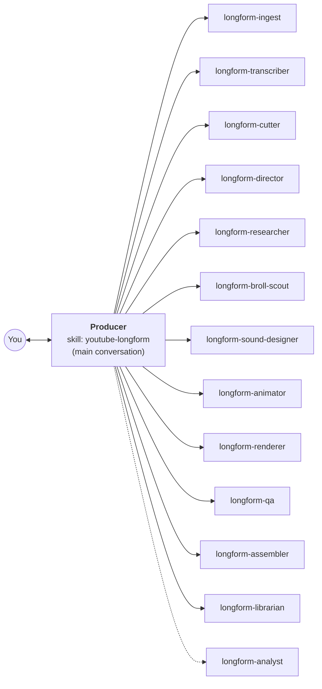
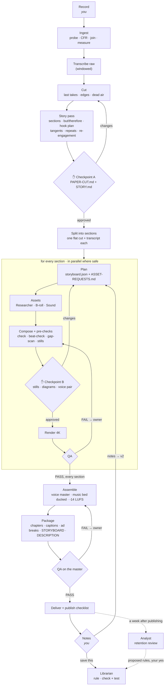

# YouTube long-form: the agent team

The agent team for **YouTube long-form videos**: roughly 8 to 25 minutes, a hook and several sections, 4K at 30 fps,
**free tools only**.
It implements the workflow in [`../README.md`](../README.md) for this one profile, on top of the reference kit
([`../../WeAreNoCode-YouTube-Editor/`](../../WeAreNoCode-YouTube-Editor/)), with the project files from
[`../templates/`](../templates/README.md), and with professional long-form practice built in from
[background research](RESEARCH.md).

```
longform/
├── README.md                     this file
├── RESEARCH.md                   what professional long-form YouTubers do, with sources and confidence levels
├── skill/youtube-longform/       → install to .claude/skills/youtube-longform/
│   ├── SKILL.md                  the Producer: runs in your main conversation
│   └── PLAYBOOK.md               the long-form doctrine every agent follows (§L0 to §L14)
└── agents/                       → install to .claude/agents/
    ├── longform-ingest.md        ├── longform-animator.md
    ├── longform-transcriber.md   ├── longform-renderer.md
    ├── longform-cutter.md        ├── longform-qa.md
    ├── longform-director.md      ├── longform-assembler.md
    ├── longform-researcher.md    ├── longform-librarian.md
    ├── longform-broll-scout.md   └── longform-analyst.md
    └── longform-sound-designer.md
```

---

## 1. What makes long-form different

The kit edits hooks and sections well. A long video adds problems a hook doesn't have, and this team is built around
them:

| Long-form problem | What the team does | Where |
|---|---|---|
| The title and thumbnail make a promise the first minute must keep | the Producer records a **Brief**; the Director's story pass checks where the promise is paid off | PLAYBOOK §L1 |
| YouTube judges the intro at 30 s | a hook shape for 0 to 30 s, a flash-forward when the opening is weak | §L2 |
| A middle that sags | sections joined by **but / therefore**, re-hooks at every boundary, strong beats near 3:00 and 6:00 | §L3 |
| Over-editing (the 2023 "retention editing" look) | tight early, clarity later, breathers after payoffs, every change must earn its place | §L4 |
| Tangents and repeated points | flagged in a story pass at Checkpoint A, for you to decide | §L5 |
| One composition can't hold 20 minutes | the approved cut is **split into sections**, each planned, built, rendered and checked alone, then assembled | §L0 |
| Music across 20 minutes | one full-length bed timed to the sections, ducked under the voice on the master | §L9 |
| Publishing | chapters validated, closed captions, mid-roll ad-break candidates, end-screen zone, disclosure reminders | §L11, §L12 |
| Not knowing what works for *your* audience | a retention review a week after publishing, mapped onto the storyboard | §L13 |

## 2. Install

From the folder you run Claude Code in (the one with your `videos/`), with this repository's `Editing-Workflow/`
folder and the kit's `youtube-edit` skill already installed (`.claude/skills/youtube-edit/`):

```bash
mkdir -p .claude/skills .claude/agents
cp -R Editing-Workflow/longform/skill/youtube-longform .claude/skills/
mkdir -p .claude/skills/youtube-longform/templates && cp -R Editing-Workflow/templates/. .claude/skills/youtube-longform/templates/
cp Editing-Workflow/longform/agents/longform-*.md .claude/agents/
```

Then open a **new** conversation (skills and agents load at the start of one) and say:

> Use my long-form team to edit this video. The raw clips are [file names], in this order.

The Producer checks the setup first (section 0 of its SKILL.md) and tells you anything missing. Optional: a free
`PEXELS_API_KEY` in your environment for stock B-roll.

**Models.** Every agent file says `model: inherit` (the conversation's model). To save cost, set the `model:` field
of the small-tier agents (Ingest, Transcriber, B-roll scout, Sound designer, Renderer, Assembler) to a smaller model;
keep the Producer, the Director and the Librarian on the strongest.

**Keeping the source in sync.** The installed copies under `.claude/` are the live ones. When the Librarian saves a
rule, it lists the files it changed; copy them back here so the repository keeps the learning.

## 3. The team



| Agent | Jobs | Runs | Writes |
|---|---|---|---|
| **Producer** (skill) | everything below, the checkpoints, routing | the whole project | `STATUS.md`, `NOTES.md`, every brief |
| `longform-ingest` | copy, probe, classify, CFR, join, align, measure level and colour | at the start; new files | `ingest.json`, `source.mp4`, `metadata.json`, `ingest/INGEST.md`, `raw-cfr/`, `aligned/` |
| `longform-transcriber` | `raw`, `flat`, `section`, `render` (windowed Parakeet, sanity checks) | after every change to a file that is timed | `transcript-raw.json`, `speech.v1`, `transcript.json`, `<part>/transcript.json`, `qa/*-transcript.json` |
| `longform-cutter` | `cut`, `note`, `split` | the flat cut; cut notes; after Checkpoint A | `cut-list.json`, `cut-map.json`, `PAPER-CUT.md`, `CUT-REVIEW.html`, `keeps.txt`, `sections.json`, `<part>/public/input-video.mp4` |
| `longform-director` | `story`, `plan`, `replan` | before Checkpoint A; per section; on-screen notes | `STORY.md`, `<part>/storyboard.json`, `<part>/ASSET-REQUESTS.md` |
| `longform-researcher` | logos, sites, pages, posts, screenshots, product photos, icons | per section, in parallel | files in `public/img/` and `_shared/img/`; its rows |
| `longform-broll-scout` | free licensed stock B-roll | per section, in parallel | `broll-shortlist.md`, `broll/`, `<part>/public/broll/`; its rows |
| `longform-sound-designer` | `assets`, `voice`, `bed` | per section; voice before Checkpoint B; bed after assembly | `_shared/sfx/`, `music/`, `voice/`; its rows |
| `longform-animator` | `build`, `rebuild` | per section, after Gate G6 | `<part>/public/index.html`, `<part>/snaps/` |
| `longform-renderer` | `render`, `patch` | per section, after Checkpoint B | `<part>/output-4k.mp4` (earlier versions kept) |
| `longform-qa` | verify a section, a patch, the master | after every render | `<part>/QA.md`, `QA.md` (master), `VERIFY.md`, `qa/` |
| `longform-assembler` | master, music duck, chapters, captions, ad breaks, documents, delivery | when every part passed | `assembly.json`, the master and twin, `chapters.txt`, `captions.srt`, `ad-breaks.txt`, `STORYBOARD.md`, `DESCRIPTION.md` |
| `longform-librarian` | save a note as a rule; a repeat as a check + test | on "save this to the skill" | `SKILL.md`, `PLAYBOOK.md`, `STYLE-GUIDE.md`, scripts and tests |
| `longform-analyst` | `teardown`, `retention` | every two videos; a week after publishing | `videos/_teardown/COMPARE.md`, `RETENTION.md` |

## 4. The long-form flow



## 5. Files the long-form team adds

On top of the kit's files and the four project files ([`../templates/`](../templates/README.md)):

```
videos/<project>/
├── STATUS.md · NOTES.md · QA.md (master)         the project files
├── ingest/INGEST.md, ingest/stills/, ingest/colour/   Ingest: every file measured, flags with stills
├── raw-cfr/ · aligned/                           Ingest: constant-frame-rate copies; aligned face/screen pairs
├── keeps.txt                                     Cutter: the hand-cut --keep arguments
├── STORY.md                                      Director: sections, joins, hook plan, re-engagement map, candidate cuts
├── sections.json                                 Cutter: each section's flat-cut start, end, length
├── voice/before.wav, after.wav, CHAIN.txt        Sound designer: the voice-polish pair (only if proposed)
├── music/master-bed.wav, BED.md                  Sound designer: the full-length bed and its changes
├── assembly.json                                 Assembler
├── RETENTION.md                                  Analyst: the retention review
└── <NN-slug>/                                    one folder per section (00-hook, 01-..., NN-sponsor)
    ├── public/input-video.mp4, cut-list.json, cut-map.json, transcript.json, audio.wav
    ├── storyboard.json · ASSET-REQUESTS.md · QA.md
    ├── plan/ (shot stills) · snaps/ · qa/ · output-4k.mp4 (+ earlier versions)
```

Delivered to `~/Movies/YouTube Renders/<project>/` (or `~/Videos/...` off a Mac): the master, the no-music twin,
`chapters.txt`, `captions.srt`, `ad-breaks.txt`, `STORYBOARD.md`, `DESCRIPTION.md`, `ASSEMBLY.md`, `PAPER-CUT.md`.

## 6. The research, in one table

Full detail, sources and confidence levels: [`RESEARCH.md`](RESEARCH.md).

| Finding | Source level | Became |
|---|---|---|
| YouTube measures the intro at 30 s; over half still watching = above typical | Official | the hook shape (§L2), the retention review (§L13) |
| The first minute must deliver the thumbnail's promise; front-load the best moment | Documented (MrBeast production guide) | §L1, the flash-forward (§L2) |
| Re-engagement around minutes 3 and 6 | Documented | the re-engagement map (§L3) |
| Replace "and then" with "but" and "therefore" | Documented (Trey Parker, Randy Olson) | section joins and WEAK flags (§L3) |
| Slower, story-led pacing outperformed the "overstim" style (38 → 23 cuts a minute) | Documented (MrBeast, Tubefilter) | tight early, clarity later, breathers (§L4) |
| B-roll is the largest share of a pro team's edit time; it must illustrate | Documented (Ali Abdaal's team) | proof first, the B-roll scout's checks (§L6) |
| Murch's Rule of Six: emotion > story > rhythm > eye trace | Documented | cut tie-breaker, kept-on-purpose pauses (§L5) |
| J and L cuts; continuous room tone | Practice | split edits inside sections (§L5) |
| Voice chain: high-pass, light denoise, EQ, gentle compression, de-ess | Practice | opt-in voice polish with a before/after pair (§L9) |
| Music 15 to 20 dB under the voice; -14 LUFS / -1 dBTP working target | Practice | 16 / 19 dB ducking, re-levelled master (§L9) |
| Correct before grading; the skin line shows hue only | Practice | measure and propose, never grade unasked (§L10) |
| 4K SDR 35 to 45 Mb/s at 30 fps, H.264 High, closed GOP, AAC 48 kHz | Official | the delivery spec (§L12) |
| Chapters: 0:00 first, at least 3, each 10 s or more | Practice | the Assembler validates (§L12) |
| End screens use the last 5 to 20 s | Official | the end-screen zone (§L12) |
| Mid-rolls on videos of 8 minutes or more, at natural breaks | Official | `ad-breaks.txt` (§L12) |
| Paid promotion and realistic synthetic content must be disclosed | Official | the publish checklist (§L11) |
| Closed-caption files beat burned-in text for long-form | Practice | `captions.srt`, no burned-in captions (§L8, §L12) |

## 7. Limits, and what isn't built yet

- **Agents can't listen.** Sound decisions are measured (levels, presence, loudness); anything that needs ears (the
  voice polish, the music's mood) comes to you as files to play.
- **Section joins are hard cuts** (`assemble.py` concatenates), so split edits live inside sections.
- **Captions are built by the Assembler** from the master's transcript, following §L12; a dedicated script with a test
  would make this more robust (a good first job for the Librarian).
- **Retention data** comes from you (a screenshot or CSV of YouTube Studio); the agents have no YouTube account access.
- **Reels** (9:16, 1080x1920, 60 fps, free tools only) is a separate profile with its own team:
  [`../reels/`](../reels/README.md). Its `moments` route cuts reels out of a long-form project.
