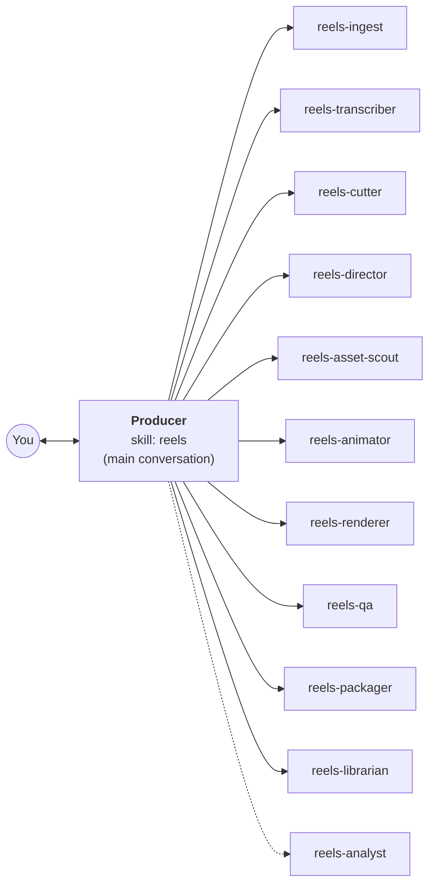
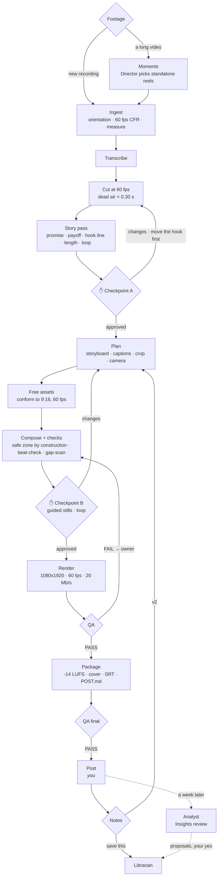

# Reels: the agent team (free tools only)

The agent team for **vertical short videos**: Instagram Reels first, and the same file posts as a YouTube Short and a
TikTok. **1080x1920, 60 fps, 15 to 60 s by default (up to 3 minutes), free tools only.** It implements the workflow in
[`../README.md`](../README.md) for this profile, on top of the reference kit
([`../../WeAreNoCode-YouTube-Editor/`](../../WeAreNoCode-YouTube-Editor/), untouched), with the project files from
[`../templates/`](../templates/README.md), short-form practice from [background research](RESEARCH.md), and **new,
tested scripts** for the vertical format the kit doesn't have.

```
reels/
├── README.md                       this file
├── RESEARCH.md                     what works in short vertical video, with sources and confidence levels
├── skill/reels/                    → install to .claude/skills/reels/
│   ├── SKILL.md                    the Producer: runs in your main conversation
│   ├── PLAYBOOK.md                 the Reels doctrine every agent follows (§R0 to §R14)
│   └── scripts/
│       ├── reels-compose.py        storyboard.json → a 1080x1920, 60 fps HyperFrames composition with burned-in captions
│       ├── reels-conform.py        any clip, screen recording or still → a vertical 60 fps cutaway (cover / blur / contain)
│       ├── reels-safezone.py       draws the platforms' UI zones over snapshots so problems are visible
│       ├── reels-captions.py       an SRT caption file for Shorts / TikTok / Facebook
│       ├── reels-storyboard-md.py  the delivery STORYBOARD.md (beats, captions, loop, assets and licences)
│       ├── reels_lib.py            shared: the safe zone, caption chunking, SRT
│       └── tests/                  30 tests (python3 -m unittest tests)
└── agents/                         → install to .claude/agents/
    ├── reels-ingest.md        ├── reels-animator.md
    ├── reels-transcriber.md   ├── reels-renderer.md
    ├── reels-cutter.md        ├── reels-qa.md
    ├── reels-director.md      ├── reels-packager.md
    ├── reels-asset-scout.md   ├── reels-librarian.md
                               └── reels-analyst.md
```

---

## 1. What makes a reel different

| Reel problem | What the team does | Where |
|---|---|---|
| The first second decides it (Instagram reports a **skip rate**: gone in 3 s) | hook text on screen by 0.3 s, the strongest line moved to the front, the composer warns when nothing lands in 0.5 s | PLAYBOOK §R2 |
| The app's buttons, caption and audio line cover the video | one safe zone (Meta's box, the strictest of the three apps) enforced **by construction**, drawn on every snapshot | §R3 |
| Most people watch muted | **burned-in word captions** from the final cut: 1 to 3 words, the spoken word turns cyan, money amber, names spelled right | §R5 |
| Ranking favours watch time, rewatches and **sends** | built around a promise, a payoff, a send-worthy moment, and a **loop** ending | §R1, §R6 |
| Short-form pacing | dead air under 0.30 s, something changes every 2 to 4 s, alternating framing on jump cuts, no overstim | §R4 |
| Free tools only | free sources for stock, sound and music, licences saved, nothing paid | §R10 |
| Turning long videos into reels | a moments pass on the long transcript, cut from the 4K source, cropped to vertical, made to stand alone | §R12 |
| Learning what works for *your* audience | an Insights review a week after posting | §R13 |

## 2. Install

From the folder you run Claude Code in, with the kit's `youtube-edit` skill already installed
(`.claude/skills/youtube-edit/`) and this repository's `Editing-Workflow/` folder present:

```bash
mkdir -p .claude/skills .claude/agents
cp -R Editing-Workflow/reels/skill/reels .claude/skills/
cp -R Editing-Workflow/templates .claude/skills/reels/templates
cp Editing-Workflow/reels/agents/reels-*.md .claude/agents/
# GSAP (free animation library) locally, so renders work offline:
mkdir -p .claude/skills/reels/assets/vendor && cd .claude/skills/reels/assets/vendor \
  && npm pack gsap@3.14.2 && tar -xzf gsap-3.14.2.tgz && cp package/dist/gsap.min.js . && rm -rf package gsap-3.14.2.tgz && cd -
# check the scripts:
cd .claude/skills/reels/scripts && python3 -m unittest tests && cd -
```

Then open a **new** conversation and say:

> Make a reel from this clip: [file]. The promise is [one line].

or

> Cut three reels out of my long video [project].

Optional, free: a `PEXELS_API_KEY` in your environment for stock footage. Models: every agent says `model: inherit`;
set smaller models on Ingest, Transcriber, Asset scout, Renderer and Packager to save cost, and keep the Producer,
Director and Librarian on the strongest.

## 3. The team



| Agent | Jobs | Writes |
|---|---|---|
| **Producer** (skill) | the brief, every stage, both checkpoints, routing, delivery, the Insights offer | `STATUS.md`, `NOTES.md`, briefs |
| `reels-ingest` | copy, probe, orientation, constant 60 fps, join, align, measure; or point at a long-form source | `ingest/INGEST.md`, `metadata.json`, `raw-cfr/` |
| `reels-transcriber` | `raw`, `flat`, `render` (Parakeet, windowed for long sources) | `transcript-raw.json`, `transcript.json` (the captions come from it) |
| `reels-cutter` | `cut`, `hook` (move the best line first), `from-long`, `note` | `cut-list.json`, `cut-map.json`, `PAPER-CUT.md`, `public/input-video.mp4` at 60 fps |
| `reels-director` | `moments`, `story`, `plan`, `replan` | `MOMENTS.md`, `STORY.md`, `storyboard.json`, `ASSET-REQUESTS.md` |
| `reels-asset-scout` | logos, pages, screenshots, B-roll, screen recordings, sounds, music: free and licensed | assets + their rows |
| `reels-animator` | compose, lint, beat-check, gap-scan, guided snapshots, loop check | `public/index.html`, `snaps/guides/sheet.png`, `snaps/loop.png` |
| `reels-renderer` | 1080x1920, 60 fps, 20 Mb/s, BT.709 | `output.mp4` (versions kept) |
| `reels-qa` | the 14 checks + 5 reel checks, on frames from the file itself | `QA.md` |
| `reels-packager` | loudness (picture copied), music mix, covers, SRT, post caption, checklist | `deliver/` |
| `reels-librarian` | a note → a rule; a repeat → a check + test | PLAYBOOK, SKILL.md, STYLE-GUIDE, scripts, tests |
| `reels-analyst` | `insights` (a week after posting), `teardown` | `INSIGHTS.md`, `videos/_reels/INSIGHTS.md` |

Compared with long-form there are no sections, so no split and no assembly; the three long-form asset agents are one
**asset scout** (a reel needs few assets, all free); the Assembler becomes a **Packager** (one file, a post caption, a
cover).

## 4. The flow



## 5. The scripts, and how they were verified

The kit builds 16:9 only, and the reference folder stays untouched, so Reels has its own scripts. They write the same
structure the kit's checkers read, so `beat-check.py`, `gap-scan.py`, `snap-beats.py` and `verify-render.py` work on
reels unchanged.

| Script | Does |
|---|---|
| `reels-compose.py` | 10 formats (hook, headline, point, steps, pills, logo, chip, stat, clip, image), burned-in captions, camera, sounds; fails the build on a block past the safe zone, a hook over 60 characters, a beat without an anchor, a zoom over 1.6; warns on the same device twice in a row and on an empty first 0.5 s |
| `reels-conform.py` | any source → 1080x1920 (or 2160x3840) at 60 fps, no audio, dense keyframes, BT.709; `--fit cover --focus`, `blur` (screen recordings), `contain`; stills become a push; a 3-frame sheet |
| `reels-safezone.py` | red: covered by the app; orange: the button-column band; cyan: the caption slot; on any 9:16 snapshot, plus a sheet |
| `reels-captions.py` | an SRT from the final transcript, names spelled right |
| `reels-storyboard-md.py` | the delivery storyboard with assets and licences |

**Verified on 2026-10-08:**
- **30 unit tests pass.** They include the kit's own `beat-check.py` and `gap-scan.py` running on a composed reel.
- **A synthetic 12 s reel went through the whole pipeline.** It used every format, a conformed landscape clip, captions and sounds:
  1. composed
  2. `npx hyperframes check` passed (0 errors)
  3. snapshotted and looked at with the safe zone drawn on
  4. rendered with HyperFrames at **1080x1920, 60/1 fps, 20.1 Mb/s**
  5. passed the kit's `verify-render.py` on size, colour tags, bitrate, duration, A/V and black frames
- **That run caught a real bug.** An SVG logo without its own size rendered as an empty plate. It's fixed, and a test now guards it.

## 6. Limits

- **Not yet run on real footage.** The first real reel is the real test; expect a round of tuning, which the Librarian
  saves.
- **Agents can't listen.** Sound is measured; anything that needs ears comes to you as files.
- **Safe-zone numbers vary by app and version.** The strictest published box is used; a phone preview is the final
  check when anything sits near an edge.
- **Instagram Insights** come from you (a screenshot); the agents have no account access.
- **A 30 fps recording** still makes a 60 fps reel, but the footage itself moves at 30; record at 60.
