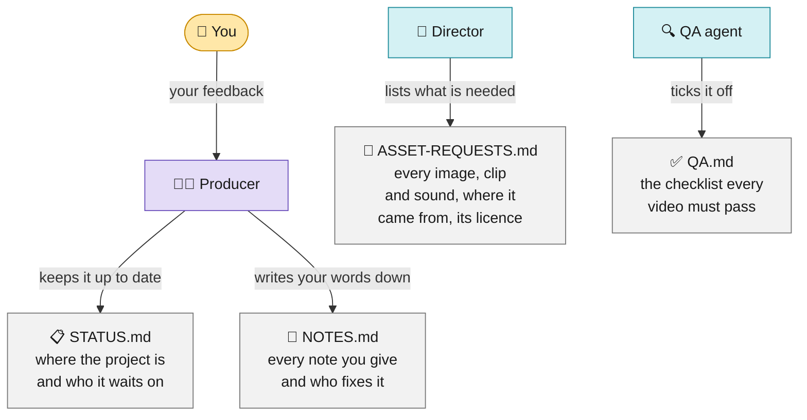
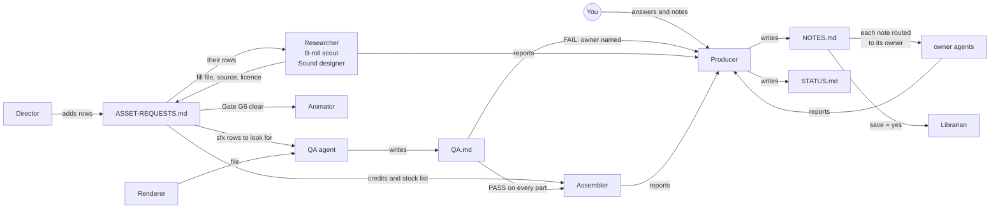
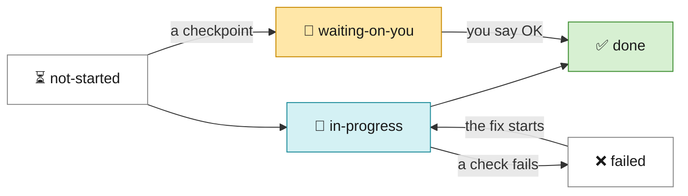
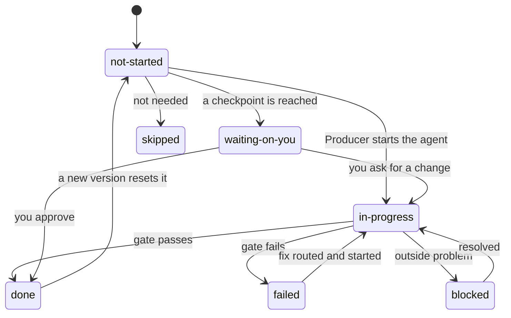
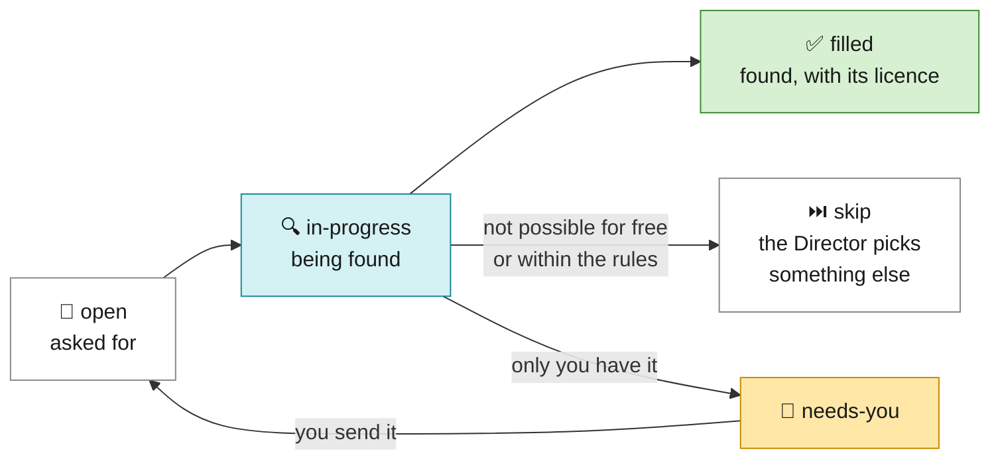
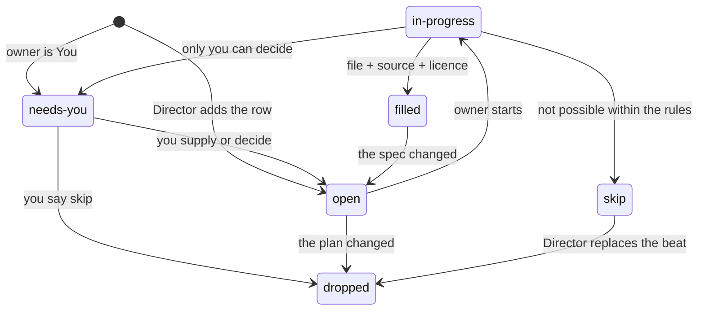
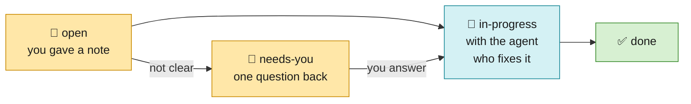
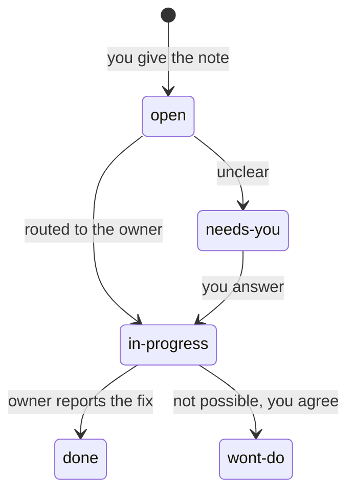

# The four project files

The kit's scripts already write most of a project's files (`cut-list.json`, `PAPER-CUT.md`, `VERIFY.md`...). This
workflow adds four more. Together they answer the four questions the kit leaves open:

| File | Answers | Written by | Read by | Created | Updated |
|---|---|---|---|---|---|
| [`STATUS.md`](STATUS.md) | Where is this video, and who is it waiting on? | **Producer only** | you, the Producer, any new conversation | Stage 2 Ingest | at every hand-off |
| [`ASSET-REQUESTS.md`](ASSET-REQUESTS.md) | What does the plan need, who gets it, where did it come from, may we use it? | **Director** (request columns), **owner agent** (fulfilment columns of its own rows) | Animator, Assembler, QA agent, you | Stage 5 Plan | until Gate G6 is clear; again on every plan change |
| [`QA.md`](QA.md) | Can this file go out? | **QA agent only** | Producer, the owner of each fix, Assembler, you | Stage 9 Verify | on every render, patch and master |
| [`NOTES.md`](NOTES.md) | What did you ask for, and what was done about it? | **Producer only** | the owner of each note, Librarian, you | Checkpoint A | on every answer and every note |

Each template has its rules in a comment at the top, so an agent that opens the file sees them. Filled-in examples
for one made-up project are in [`examples/`](examples/): a 38-second hook, on its second version, where the four files
point at each other.

> The workflow README listed a fifth new file, `ASSETS.md` (sources and licences). It is merged into
> `ASSET-REQUESTS.md`: one row follows an asset from request to licence, so nothing can be used without a record.

---

## How the four files connect



<sub>🟨 yellow = you · 🟦 blue = the AI team · 🟩 green = finished</sub>

<details>
<summary>Show the detailed version (who reads and writes each file)</summary>



</details>

The Producer is the only one that writes `STATUS.md` and `NOTES.md`; the QA agent is the only one that writes
`QA.md`; `ASSET-REQUESTS.md` is shared, but by column: the Director owns the request, the owner agent owns the
fulfilment. No file has two writers for the same cell.

---

## Starting a project

At ingest the Producer copies the templates into the project folder and fills the header:

```bash
cp Editing-Workflow/templates/{STATUS,ASSET-REQUESTS,QA,NOTES}.md videos/<project>/
```

A video in several parts (hook, intros, sections) keeps **one** `STATUS.md` and **one** `NOTES.md` for the whole
video, and **one `ASSET-REQUESTS.md` and one `QA.md` per part** (`videos/<project>/<part>/`), because each part has its
own storyboard and its own render.

---

## Conventions shared by all four

| Rule | Detail |
|---|---|
| One writer per cell | see the table above; agents report, they don't edit someone else's file |
| IDs never change | each file has its own prefix (below); an ID is never reused or renumbered |
| Nothing is deleted | a row that no longer applies is closed: `done`, `dropped`, `wont-do`, or a Closed date |
| Fixed vocabularies | every `state`, `kind` and `Result` value comes from the lists below, spelled exactly |
| Times in video | seconds in the timeline named by the file (flat cut for requests; the watched version for notes), e.g. `14.03`; `m:ss` is fine for a note you gave |
| Clock times | local, `YYYY-MM-DD HH:MM` |
| Paths | relative to the project folder (`public/broll/x.mp4`, `../_shared/sfx/pop.mp3`) |
| Empty cells | `-` |
| Plain words | a row should make sense to you without opening another file |

| Prefix | Used for | In |
|---|---|---|
| `r01` | an asset request | ASSET-REQUESTS.md |
| `Q1` | a QA failure | QA.md |
| `A01` / `B01` / `n01` | your answer at Checkpoint A / B, or a note on a draft | NOTES.md |
| `D01` | a decision the Producer asked you for | STATUS.md |
| `K01` | a blocker | STATUS.md |

---

## STATUS.md

The one page that says where the video is. Any conversation can pick the project up from it.

### Sections

| Section | What it holds |
|---|---|
| Header | project, profile, parts, version, current stage, waiting on, next step, updated |
| Brief | the creator's answers at the start: title, thumbnail, promise, audience, target length, sponsor, music, terms to spell right, must-include moments. The Director plans against it; the Assembler takes the terms and the sponsor from it |
| Stages | all 15 rows (stages 1 to 12, checkpoints A and B, Done), always in this order |
| Versions | one row per version: when it started, why, its QA results, when it was delivered, the file |
| Decisions for you | every question the Producer asked you, the options, your answer |
| Blockers | anything stuck: what, since when, owner, next step, when it closed |
| Log | one line per event, newest at the bottom |

### Stage fields

| Field | Meaning |
|---|---|
| `#` | stage number (1 to 12), or `A` / `B` for the checkpoints, `-` for Done |
| `State` | see below |
| `Owner` | the agent (or you) responsible right now |
| `Gate` | the gates this stage must pass (README section 7) |
| `Updated` | when the state last changed |
| `Note` | one line: the result, or why it is waiting |

### Stage states

| State | Meaning |
|---|---|
| `not-started` | nothing done yet in this version |
| `in-progress` | an agent is working on it |
| `waiting-on-you` | a checkpoint or decision needs you |
| `failed` | a gate failed; the fix is routed (a row in Blockers says to whom) |
| `blocked` | nobody can continue until something outside the workflow changes; a row in Blockers |
| `done` | its gate passed |
| `skipped` | not needed for this video (e.g. Assemble for a single part delivered directly) |



<details>
<summary>Show every state and what moves a stage between them</summary>



</details>

### Rules

- **A new version** (v2, v3...) resets stages 5 to 11 to `not-started`, unless every note touches only later stages
  (a render glitch resets 8 to 10). Stages 2 to 4 reset only when the cut changes.
- Every `failed` or `blocked` stage has an open row in Blockers.
- The header's "Waiting on" is always true: if it says "you", there is an open decision or checkpoint.

---

## ASSET-REQUESTS.md

The ledger of everything the composition uses that isn't your footage: what the plan asked for, who gets it, the file,
where it came from, its licence and the seconds used.

### Fields

| Field | Filled by | Meaning |
|---|---|---|
| `id` | Director | `r01`, `r02`... |
| `kind` | Director | see the kinds table |
| `beat` | Director | the beat `id` in `storyboard.json` that uses it (`-` for a bed under everything) |
| `at` | Director | flat-cut time, in seconds, when it first appears |
| `dur` | Director | seconds on screen or audible |
| `spec` | Director | exactly what is needed, in one line (what each kind must say: below) |
| `owner` | Director | the agent that gets it (from the kinds table), or `You` |
| `state` | owner (Producer for `needs-you`) | see below |
| `file` | owner | where it is, relative to the project folder |
| `source` | owner | the page or library it came from |
| `licence` | owner | the licence, by name |
| `used` | owner | the part used (`12.0 to 15.5 s of the source`, `whole file`, `top 1080 px`) |
| `note` | owner, Producer | anything the next reader needs: why a candidate was rejected, why a row was skipped, your answer |

### Kinds, owners, and what the spec must say

| kind | Owner | The spec must say |
|---|---|---|
| `logo` | Researcher | the brand; the variant (white, colour, dark); the plate it sits on |
| `site` | Researcher | the exact URL (the `/en` version); glance (under 3 s) or scroll, and how far |
| `page` | Researcher | the URL; headline only (format 18) or which passages (18b); rebuild needed |
| `post` | Researcher | the post URL or ID; light or dark |
| `screenshot` | Researcher | which screen; if it is yours, `owner` is `You` |
| `product-photo` | Researcher | the product; cut out or not |
| `icon` | Researcher | which icon (the kit's line icons first) |
| `photo` | **You** | the person and the crop (a person's photo always comes from you) |
| `screen-recording` | **You** | what to record, or which existing file |
| `b-roll` | B-roll scout | subject, mood, orientation (16:9 or 9:16), length, where in the clip to start |
| `sfx` | Sound designer | which allowed sound, what on screen causes it, the volume (README section 6.7) |
| `music` | Sound designer | role (hook tension or body bed), length, how far it ducks under your voice |

Rows owned by **You** start as `needs-you`. **In the Reels profile** one agent fills every non-You row: the owner is
`Asset scout` wherever this table says Researcher, B-roll scout or Sound designer.

### States

| State | Meaning | Who sets it |
|---|---|---|
| `open` | requested, not started | Director |
| `in-progress` | the owner is getting it | owner |
| `filled` | `file`, `source`, `licence` and `used` are all filled | owner |
| `skip` | the owner could not get it within the rules; `note` says why; the Director picks another format | owner |
| `needs-you` | only you can supply or decide it | Producer |
| `dropped` | no longer needed (the plan changed, or you said skip) | Director or Producer |



<details>
<summary>Show every state and what moves a row between them</summary>



</details>

### Rules

- **Gate G6:** the Animator starts only when no row is `open`, `in-progress` or `needs-you`. The header shows
  `clear` or how many rows are left.
- A row is not `filled` without a licence. The licence rules are the kit's: Pexels first, then Coverr and Mixkit's
  free licence; never Mixkit Restricted, AI-labelled or paid stock; never work around a bot block, paywall or login.
- `skip` always comes with a reason in `note`, and the Director must answer it (replace the beat, or drop it).
- Anything whose licence asks for credit gets a line in **Credits**; the Assembler copies it into `STORYBOARD.md` and
  the description.
- The QA agent checks every `sfx` row in the render, by its `at` time.

---

## QA.md

The QA agent's verdict on every file before it goes anywhere. It measures, decides and names the owner of each fix.
It never fixes anything itself.

### Structure

- A header with the latest verdict.
- **One section per file checked, newest at the top**, titled `## v2 · hook · attempt 1 · PASS`. Old sections are
  never edited; a re-check is a new section with the next attempt number.
- Each section: the file and its md5, the 14 checks, the sounds, the failures, the verdict.

### The 14 checks

| # | Check | Tool | PASS when |
|---|---|---|---|
| 1 | Black frames and flashes | `verify-render.py` (blackdetect, catches a 2-frame flash) | none |
| 2 | Size | `verify-render.py --res` | matches the profile |
| 3 | Colour tags | `verify-render.py` | primaries, transfer and matrix all bt709 |
| 4 | Video bitrate | `verify-render.py` | at or over 40 Mb/s at 4K, scaled by pixel count |
| 5 | Duration | `verify-render.py --index` | the composition's `data-duration` ± 1 frame |
| 6 | A/V sync | `verify-render.py` | video and audio lengths within 0.12 s |
| 7 | Clipped words | `verify-render.py --words --kept` (the render transcribed) | no kept word missing |
| 8 | Every sound present | decode render and footage, gain-match, subtract, read the RMS in each sound's window | every `sfx` row in ASSET-REQUESTS.md stands clearly above the two quiet controls |
| 9 | Motion at transitions | `ffmpeg … select='between(n,A,B)',tile=6x7` strips | no jump-then-crawl, dead stop or one-frame pop |
| 10 | Loudness | `ffmpeg … ebur128` | the master at -14 LUFS ± 1 |
| 11 | True peak | `ffmpeg … ebur128` | the master under -1 dBTP |
| 12 | Lip sync | a flat frame matched to the source at `src_start + x` | within one frame |
| 13 | Safe zones (reels) | `render-sheet.png` | nothing important in the bottom ~20 % or the right edge |
| 14 | Frame rate | `ffprobe` | the profile's rate, constant |

**On an assembled master** (long-form), five more rows follow: **15** duration (the sum of the parts), **16** chapters
(`0:00` first, at least 3, each at least 10 s, in order), **17** captions (`captions.srt` parses, cues in order, no
overlaps, 1 to 6 s, at most 2 lines), **18** end-screen zone (nothing in the end-screen element areas in the last
20 s), **19** music under voice (the bed present, the voice never masked). Details in
`Editing-Workflow/longform/agents/longform-qa.md`.

### Results

| Result | Meaning |
|---|---|
| `PASS` | measured and within the limit |
| `FAIL` | measured and outside the limit; gets a row in Failures |
| `NOTE` | outside the limit, but one of the known exceptions below |
| `N/A` | the check does not apply to this file |

**The only allowed `NOTE`s:**
- **Bitrate** under the floor on a mostly still screen, when every other check passes (hardware encoders undershoot).
- **Loudness and true peak on a part**: renders arrive at camera level (about -25 to -33 LUFS); `assemble.py` levels
  them. The master must PASS both.

**The only allowed `N/A`s:** lip sync on a hook under 60 s; safe zones on a 16:9 file; clipped words when there is no
speech; sounds when the plan has none.

### Failure fields

| Field | Meaning |
|---|---|
| `id` | `Q1`, `Q2`... numbered across the whole file, never reused |
| `at` | the time in the checked file |
| `Check` | the check number and name |
| `What was seen` | the measurement, in plain words |
| `Owner of the fix` | from the workflow README section 8 |
| `Suggested fix` | the first thing to try |

### Rules

- **Verdict** is PASS only when no check is FAIL.
- The **md5** is of the file exactly as checked; the delivered copy must match it.
- **Never compare a render with an earlier render** to find a sound: two encodes differ enough to hide a quiet one.
  Compare with the untouched footage.
- Say **"measured"** for numbers; say **"listened"** only when someone did.
- The Assembler needs the latest section of every part to be PASS; then QA checks the master as a new section.

---

## NOTES.md

Everything you asked for, word for word, and what happened to it. It is how nothing gets lost between versions, and
it is what the Librarian learns from.

### Sections

`Checkpoint A`, `Checkpoint B`, then `Notes on v1`, `Notes on v2`... (newest at the bottom), and `Saved to the skill`.

### Fields

| Field | Meaning |
|---|---|
| `id` | `A01` (Checkpoint A), `B01` (Checkpoint B), `n01` (notes on drafts) |
| `Given` | when you said it |
| `Your words` | **verbatim**; one idea per row (a message with two asks becomes two rows) |
| `at` | the time in the version you watched; for an assembled master, also the part and the time inside it (from `ASSEMBLY.md`) |
| `kind` | see below; it decides the owner |
| `Owner` | the agent the note is routed to |
| `Action` | what was done, in one line, once it is done |
| `state` | see below |
| `Fixed in` | the version that carries the fix |
| `save` | `yes`, `no`, or `ask` (worth keeping; the Producer asks you) |
| `repeat` | the id of an earlier note that asked for the same thing |

### Kinds and owners

| kind | Owner | Examples |
|---|---|---|
| `cut` | Cutter | "keep the earlier take", "the joke goes", "you cut my last word" |
| `on-screen` | Director, then Animator | "the card covers my face", "too busy", "the zoom is jumpy" |
| `asset` | Researcher or B-roll scout | "wrong logo", "that clip looks fake" |
| `sound` | Sound designer | "music too loud", "no sound on the logo" |
| `glitch` | Renderer, confirmed by QA | "a flash at 0:14", "it freezes", "out of sync" |
| `assembly` | Assembler | "the intro is quieter than the hook", "swap parts 2 and 3" |
| `general` | Producer | "make it better": the Producer asks one specific question (a Decision in STATUS.md), then re-files the note under the right kind |

### States

| State | Meaning |
|---|---|
| `open` | recorded, not yet routed |
| `in-progress` | the owner is working on it |
| `done` | fixed; `Action` and `Fixed in` filled |
| `wont-do` | not done, with the reason in `Action`, and only with your OK |
| `needs-you` | unclear; the Producer has asked you one question |



<details>
<summary>Show every state and what moves a note between them</summary>



</details>

### The learning loop in this file

- `save = yes` → the Producer briefs the Librarian with the note's id. When the rule is written, a row goes into
  **Saved to the skill**: the date, the note ids, where it went in SKILL.md (or STYLE-GUIDE.md), the rule as written,
  and whether a check or test was added.
- A note with a `repeat` and `save = yes` is a mistake that came back: the Librarian turns it into a **script check
  and a test**, not only a rule.
- A version is **clean** when every note on the previous version is `done` or `wont-do`. The Producer does not hand
  you a new version that isn't clean, unless it says which notes are still open and why.
